---
## Front matter
title: "Лабораторная работа №1"
subtitle: "дисциплина: Архитектура компьютера"
author: "Трофимов Владислав Алексеевич"

## Generic otions
lang: ru-RU\
toc-title: "Содержание"

## Bibliography
bibliography: bib/cite.bib
csl: pandoc/csl/gost-r-7-0-5-2008-numeric.csl

## Pdf output format
toc: true # Table of contents
toc-depth: 2
lof: true # List of figures
lot: true # List of tables
fontsize: 13pt
linestretch: 1.5
papersize: a4
documentclass: scrreprt
## I18n polyglossia
polyglossia-lang:
  name: russian
  options:
	- spelling=modern
	- babelshorthands=true
polyglossia-otherlangs:
  name: english
## I18n babel
babel-lang: russian
babel-otherlangs: english
## Fonts
mainfont: Times New Roman
sansfont: Times New Roman
monofont: Times New Roman
mathfont: Times New Roman
mainfontoptions: Ligatures=Common,Ligatures=TeX,Scale=0.94
romanfontoptions: Ligatures=Common,Ligatures=TeX,Scale=0.94
sansfontoptions: Ligatures=Common,Ligatures=TeX,Scale=MatchLowercase,Scale=0.94
monofontoptions: Scale=MatchLowercase,Scale=0.94,FakeStretch=0.9
mathfontoptions:
## Biblatex
biblatex: true
biblio-style: "gost-numeric"
biblatexoptions:
  - parentracker=true
  - backend=biber
  - hyperref=auto
  - language=auto
  - autolang=other*
  - citestyle=gost-numeric
## Pandoc-crossref LaTeX customization
figureTitle: "Рис."
tableTitle: "Таблица"
listingTitle: "Листинг"
lofTitle: "Список иллюстраций"
lotTitle: "Список таблиц"
lolTitle: "Листинги"
## Misc options
indent: true
header-includes:
  - \usepackage{indentfirst}
  - \usepackage{float} # keep figures where there are in the text
  - \floatplacement{figure}{H} # keep figures where there are in the text
---

# Цель работы

Целью данной работы является приобретение практических навыков установки операционной системы на виртуальную машину, настройки минимально необходимых для дальнейшей работы сервисов.

# Задание

- Установка Linux на VirtualBox
- Установка необходимого ПО
- Первоначальная настройка системы

# Теоретическое введение

Oracle VirtualBox — это программное обеспечение с открытым исходным кодом для виртуализации, позволяющее создавать и запускать виртуальные машины на компьютере с любой популярной операционной системой. Простыми словами, это программа, которая создаёт "компьютер внутри компьютера", где можно установить другую операционную систему, не затрагивая основную.

Виртуализация через VirtualBox создаёт изолированную среду, которая эмулирует аппаратное обеспечение компьютера. Это позволяет запускать полноценную операционную систему внутри вашей основной системы.

# Выполнение лабораторной работы

Установка Linux Fedora sway на VirtualBox. (рис. -@fig:001)

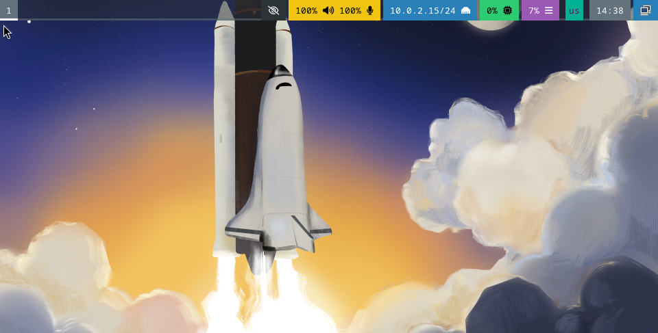{#fig:001 width=70%}

В меню виртуальной машины подключаю образ диска дополнений гостевой ОС, монтирую диск и устанавливаю драйвера.  (рис. -@fig:002)

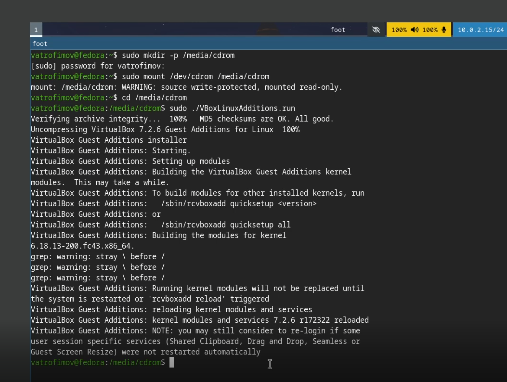{#fig:002 width=70%}

После запуска виртуальной машины устанавливаю средства разработки. (рис. -@fig:003)

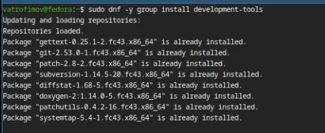{#fig:003 width=70%}

Обновление пакетов. (рис. -@fig:004)

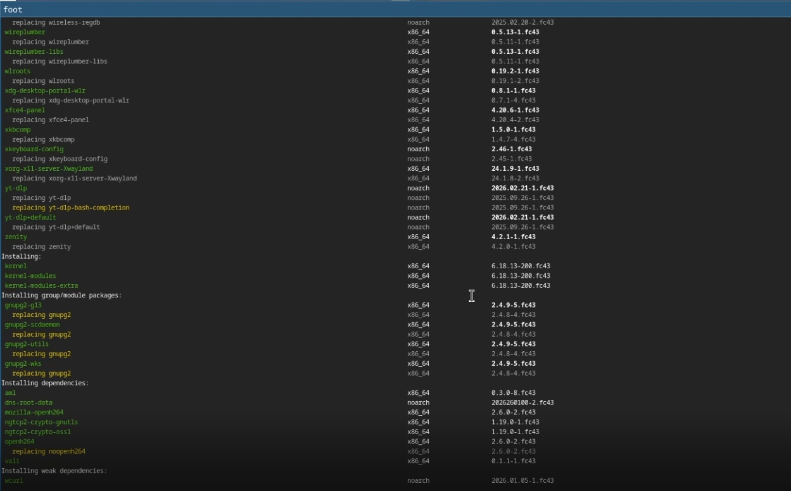{#fig:004 width=70%}

Внутри виртуальной машины добавляю своего пользователя в группу vboxsf, В хостовой системе подключаю разделяемую папку. (рис. -@fig:005)

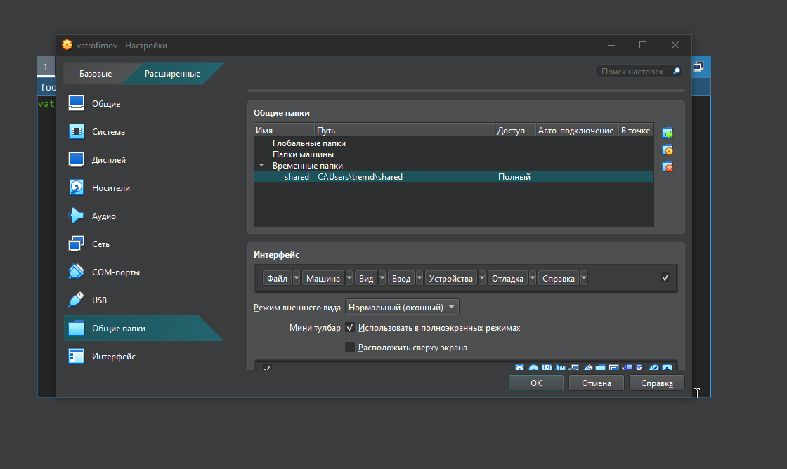{#fig:005 width=70%}

(рис. -@fig:011)

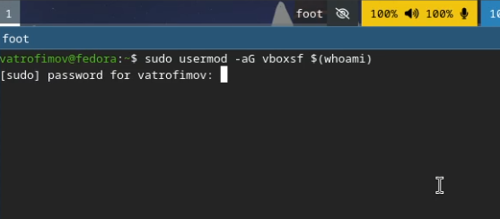{#fig:011 width=70%}

Устанавливаю tmux (Программы для удобства работы в консоли). (рис. -@fig:006)

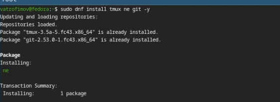{#fig:006 width=70%}

# Домашнее задание

С помощью команд получаю информацию о системе. (рис. -@fig:007)

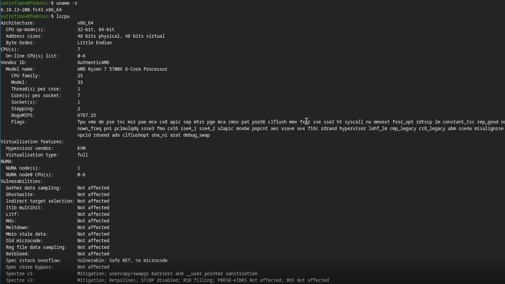{#fig:007 width=70%}

(рис. -@fig:008)

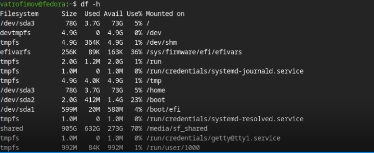{#fig:008 width=70%}

(рис. -@fig:009)

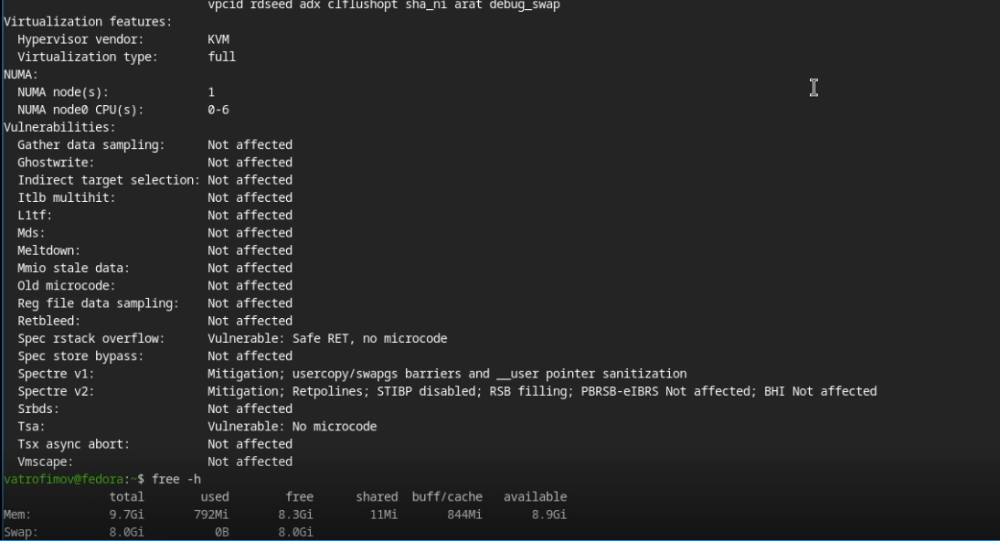{#fig:009 width=70%}

(рис. -@fig:010)

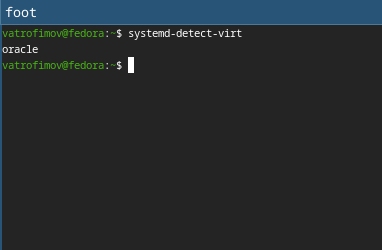{#fig:010 width=70%}

# Выводы

В ходе выполнения лабораторной работы я приобрел навыки установки виртуальной машины на VirtualBox, установил ряд пакетов и настроил OC для дальнейшей работы.

# Список литературы{.unnumbered}

::: {#refs}
:::