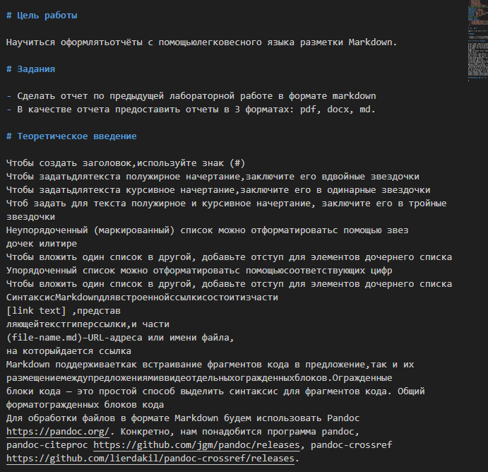
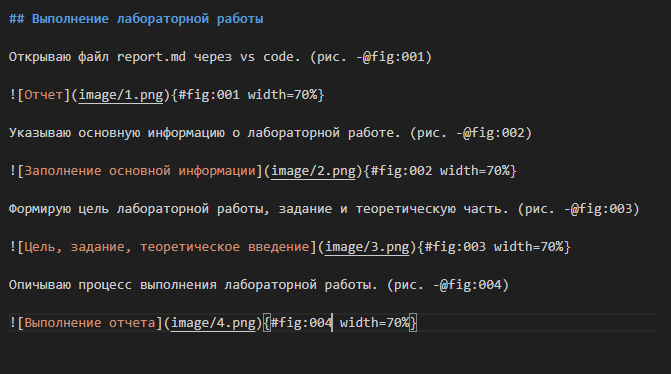

---
## Front matter
lang: ru-RU
title: Лабораторная работа №3
subtitle: Знакомство с Markdown
author:
  - Трофимов В. А.
institute:
  - Российский университет дружбы народов, Москва, Россия
date: 04 марта 2026

## i18n babel
babel-lang: russian
babel-otherlangs: english

## Fonts
mainfont: Times New Roman
sansfont: Times New Roman
monofont: Times New Roman
mathfont: Times New Roman
mainfontoptions: Ligatures=Common,Ligatures=TeX,Scale=0.94
romanfontoptions: Ligatures=Common,Ligatures=TeX,Scale=0.94
sansfontoptions: Ligatures=Common,Ligatures=TeX,Scale=MatchLowercase,Scale=0.94
monofontoptions: Scale=MatchLowercase,Scale=0.94,FakeStretch=0.9
mathfontoptions:

## Formatting pdf
toc: false
toc-title: Содержание
slide_level: 2
aspectratio: 169
section-titles: true
theme: metropolis
header-includes:
 - \metroset{progressbar=frametitle,sectionpage=progressbar,numbering=fraction}
---

# Информация

## Докладчик

:::::::::::::: {.columns align=center}
::: {.column width="70%"}

  * Трофимов Владислав Алексеевич
  * Студент НКАбд-06-25
  * Российский университет дружбы народов
  * [1032253511@rudn.ru](mailto:1032253511@rudn.ru)

:::
::::::::::::::

# Цель работы

Научиться оформлять отчёты с помощью легковесного языка разметки Markdown.

# Задания

- Сделать отчет по предыдущей лабораторной работе в формате markdown
- В качестве отчета предоставить отчеты в 3 форматах: pdf, docx, md.

# Теоретическое введение

Чтобы создать заголовок,используйте знак (#)
Чтобы задатьдлятекста полужирное начертание,заключите его вдвойные звездочки
Чтобы задатьдлятекста курсивное начертание,заключите его в одинарные звездочки
Чтоб задать для текста полужирное и курсивное начертание, заключите его в тройные
звездочки
Неупорядоченный (маркированный) список можно отформатироватьс помощью звез
дочек илитире
Чтобы вложить один список в другой, добавьте отступ для элементов дочернего списка
Упорядоченный список можно отформатироватьс помощьюсоответствующих цифр
Чтобы вложить один список в другой, добавьте отступ для элементов дочернего списка

## Теоретическое введение

Синтаксис Markdown для встроенно ссылки состоит из части
[link text] ,представляющей текст гиперссылки, и части
(file-name.md)–URL-адреса или имени файла,
на которыйдается ссылка
Markdown поддерживает как встраивание фрагментов кода в предложение,так и их
размещение между предложениями в виде отдельных огражденных блоков.Огражденные
блоки кода — это простой способ выделить синтаксис для фрагментов кода. Общий
формат огражденных блоков кода
Для обработки файлов в формате Markdown будем использовать Pandoc
https://pandoc.org/. Конкретно, нам понадобится программа pandoc,
pandoc-citeproc https://github.com/jgm/pandoc/releases, pandoc-crossref
https://github.com/lierdakil/pandoc-crossref/releases.

## Выполнение лабораторной работы

## Создание файла

Открываю файл report.md через vs code. (рис. -@fig:001)

{#fig:001 width=70%}

## Оформление

Указываю основную информацию о лабораторной работе. (рис. -@fig:002)

{#fig:002 width=70%}

## Цель, задание, теоретическое введение

Формирую цель лабораторной работы, задание и теоретическую часть. (рис. -@fig:003)

{#fig:003 width=70%}

## Выполнение отчета

Описываю процесс выполнения лабораторной работы. (рис. -@fig:004)

{#fig:004 width=70%}

# Выводы

В ходе выполнения лабораторной работы я научился оформлять отчеты с помощью языка разметки Markdown.

