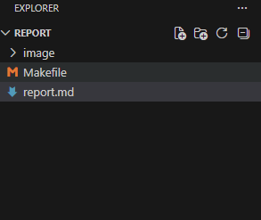
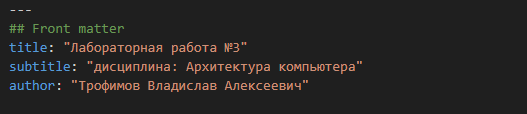

---
## Front matter
title: "Лабораторная работа №3"
subtitle: "дисциплина: Архитектура компьютера"
author: "Трофимов Владислав Алексеевич"

## Generic otions
lang: ru-RU\
toc-title: "Содержание"

## Bibliography
bibliography: bib/cite.bib
csl: pandoc/csl/gost-r-7-0-5-2008-numeric.csl

## Pdf output format
toc: true # Table of contents
toc-depth: 2
lof: true # List of figures
lot: true # List of tables
fontsize: 13pt
linestretch: 1.5
papersize: a4
documentclass: scrreprt
## I18n polyglossia
polyglossia-lang:
  name: russian
  options:
    - spelling=modern
    - babelshorthands=true
polyglossia-otherlangs:
  name: english
## I18n babel
babel-lang: russian
babel-otherlangs: english
## Fonts
mainfont: Times New Roman
sansfont: Times New Roman
monofont: Times New Roman
mathfont: Times New Roman
mainfontoptions: Ligatures=Common,Ligatures=TeX,Scale=0.94
romanfontoptions: Ligatures=Common,Ligatures=TeX,Scale=0.94
sansfontoptions: Ligatures=Common,Ligatures=TeX,Scale=MatchLowercase,Scale=0.94
monofontoptions: Scale=MatchLowercase,Scale=0.94,FakeStretch=0.9
mathfontoptions:
## Biblatex
biblatex: true
biblio-style: "gost-numeric"
biblatexoptions:
  - parentracker=true
  - backend=biber
  - hyperref=auto
  - language=auto
  - autolang=other*
  - citestyle=gost-numeric
## Pandoc-crossref LaTeX customization
figureTitle: "Рис."
tableTitle: "Таблица"
listingTitle: "Листинг"
lofTitle: "Список иллюстраций"
lotTitle: "Список таблиц"
lolTitle: "Листинги"
## Misc options
indent: true
header-includes:
  - \usepackage{indentfirst}
  - \usepackage{float} # keep figures where there are in the text
  - \floatplacement{figure}{H} # keep figures where there are in the text
---

# Цель работы

Научиться оформлять отчёты с помощью легковесного языка разметки Markdown.

# Задания

- Сделать отчет по предыдущей лабораторной работе в формате markdown
- В качестве отчета предоставить отчеты в 3 форматах: pdf, docx, md.

# Теоретическое введение

Чтобы создать заголовок,используйте знак (#)
Чтобы задатьдлятекста полужирное начертание,заключите его вдвойные звездочки
Чтобы задатьдлятекста курсивное начертание,заключите его в одинарные звездочки
Чтоб задать для текста полужирное и курсивное начертание, заключите его в тройные
звездочки
Неупорядоченный (маркированный) список можно отформатироватьс помощью звез
дочек илитире
Чтобы вложить один список в другой, добавьте отступ для элементов дочернего списка
Упорядоченный список можно отформатировать с помощью соответствующих цифр
Чтобы вложить один список в другой, добавьте отступ для элементов дочернего списка
Синтаксис Markdown для встроенно ссылки состоит из части
[link text] ,представляющей текст гиперссылки, и части
(file-name.md)–URL-адреса или имени файла,
на которыйдается ссылка
Markdown поддерживает как встраивание фрагментов кода в предложение,так и их
размещение между предложениями в виде отдельных огражденных блоков.Огражденные
блоки кода — это простой способ выделить синтаксис для фрагментов кода. Общий
формат огражденных блоков кода
Для обработки файлов в формате Markdown будем использовать Pandoc
https://pandoc.org/. Конкретно, нам понадобится программа pandoc,
pandoc-citeproc https://github.com/jgm/pandoc/releases, pandoc-crossref
https://github.com/lierdakil/pandoc-crossref/releases.

## Выполнение лабораторной работы

Открываю файл report.md через vs code. (рис. -@fig:001)

{#fig:001 width=70%}

Указываю основную информацию о лабораторной работе. (рис. -@fig:002)

{#fig:002 width=70%}

Формирую цель лабораторной работы, задание и теоретическую часть. (рис. -@fig:003)

{#fig:003 width=70%}

Описываю процесс выполнения лабораторной работы. (рис. -@fig:004)

{#fig:004 width=70%}

# Выводы

В ходе выполнения лабораторной работы я научился оформлять отчеты с помощью языка разметки Markdown.

# Список литературы{.unnumbered}

::: {#refs}
:::