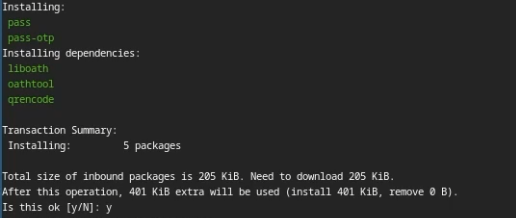
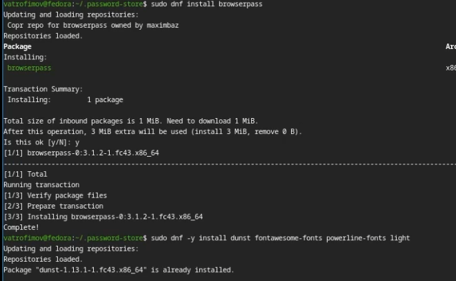
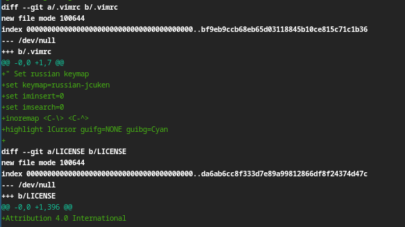
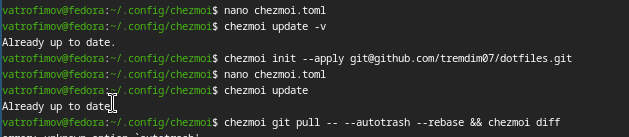

---
## Front matter
lang: ru-RU
title: Лабораторная работа №5
subtitle: ОС
author:
  - Трофимов В. А.
institute:
  - Российский университет дружбы народов, Москва, Россия
date: 05 марта 2026

## i18n babel
babel-lang: russian
babel-otherlangs: english

## Fonts
mainfont: Times New Roman
sansfont: Times New Roman
monofont: Times New Roman
mathfont: Times New Roman
mainfontoptions: Ligatures=Common,Ligatures=TeX,Scale=0.94
romanfontoptions: Ligatures=Common,Ligatures=TeX,Scale=0.94
sansfontoptions: Ligatures=Common,Ligatures=TeX,Scale=MatchLowercase,Scale=0.94
monofontoptions: Scale=MatchLowercase,Scale=0.94,FakeStretch=0.9
mathfontoptions:

## Formatting pdf
toc: false
toc-title: Содержание
slide_level: 2
aspectratio: 169
section-titles: true
theme: metropolis
header-includes:
 - \metroset{progressbar=frametitle,sectionpage=progressbar,numbering=fraction}
---

# Информация

## Докладчик

:::::::::::::: {.columns align=center}
::: {.column width="70%"}

  * Трофимов Владислав Алексеевич
  * Студент НКАбд-06-25
  * Российский университет дружбы народов
  * [1032253511@rudn.ru](mailto:1032253511@rudn.ru)

:::
::::::::::::::

# Цель работы

Познакомиться с pass, gopass, chezmoi. Научиться пользоваться этими утилитами, синхронизация с git

# Задание

- Установить доп ПО
- Установить pass
- Настроить интерфейс с браузером
- Сохранить пароль
- Установить и настроить chezmoi
- Настроить chezmoi на новой машине
- Выполнить ежедневные операции с chezmoi

# Теоретическое введение

Менеджер паролей pass
Менеджер паролей pass — программа, сделанная в рамках идеологии Unix.
Также носит название стандартного менеджера паролей для Unix (The standard Unix password manager).

Основные свойства
Данные хранятся в файловой системе в виде каталогов и файлов.
Файлы шифруются с помощью GPG-ключа.

Структура базы паролей
Структура базы может быть произвольной, если Вы собираетесь использовать её напрямую, без промежуточного программного обеспечения. Тогда семантику структуры базы данных Вы держите в своей голове.
Если же необходимо использовать дополнительное программное обеспечение, необходимо семантику заложить в структуру базы паролей.

# Выполнение лабораторной работы

## Установка pass

Устанавливаю pass. (рис. -@fig:001)

{#fig:001 width=70%}

## Инициализация

Инициализирую pass на машине и делаю первый пароль. (рис. -@fig:002)

{#fig:002 width=70%}

## Доп ПО

Устанавливаю дополнительное ПО и шрифты. (рис. -@fig:003)

{#fig:003 width=70%}

## Инициализация chezmoi

Инициализирую chezmoi с указанием на указанный в лабораторный работе репозиторий. (рис. -@fig:004)

{#fig:004 width=70%}

## Конфиг

Применяю конфиг. (рис. -@fig:005)

{#fig:005 width=70%}

## Проверка изменений

Проверяю изменения в удаленном репозитории. (рис. -@fig:006)

{#fig:006 width=70%}

## Автоматическое сохранение

Отключаю автоматическое сохранение изменений. (рис. -@fig:007)

{#fig:007 width=70%}

# Вывод

Мы познакомились с pass, gopass, chezmoi и научились работать с этими утилитами, и синхронизировали их с гит.

# Список литературы{.unnumbered}

::: {#refs}
:::