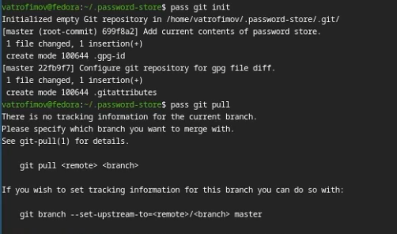
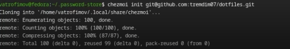
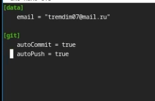

---
## Front matter
title: "Лабораторная работа №5"
subtitle: "дисциплина: Архитектура компьютера"
author: "Трофимов Владислав Алексеевич"

## Generic otions
lang: ru-RU\
toc-title: "Содержание"

## Bibliography
bibliography: bib/cite.bib
csl: pandoc/csl/gost-r-7-0-5-2008-numeric.csl

## Pdf output format
toc: true # Table of contents
toc-depth: 2
lof: true # List of figures
lot: true # List of tables
fontsize: 13pt
linestretch: 1.5
papersize: a4
documentclass: scrreprt
## I18n polyglossia
polyglossia-lang:
  name: russian
  options:
    - spelling=modern
    - babelshorthands=true
polyglossia-otherlangs:
  name: english
## I18n babel
babel-lang: russian
babel-otherlangs: english
## Fonts
mainfont: Times New Roman
sansfont: Times New Roman
monofont: Times New Roman
mathfont: Times New Roman
mainfontoptions: Ligatures=Common,Ligatures=TeX,Scale=0.94
romanfontoptions: Ligatures=Common,Ligatures=TeX,Scale=0.94
sansfontoptions: Ligatures=Common,Ligatures=TeX,Scale=MatchLowercase,Scale=0.94
monofontoptions: Scale=MatchLowercase,Scale=0.94,FakeStretch=0.9
mathfontoptions:
## Biblatex
biblatex: true
biblio-style: "gost-numeric"
biblatexoptions:
  - parentracker=true
  - backend=biber
  - hyperref=auto
  - language=auto
  - autolang=other*
  - citestyle=gost-numeric
## Pandoc-crossref LaTeX customization
figureTitle: "Рис."
tableTitle: "Таблица"
listingTitle: "Листинг"
lofTitle: "Список иллюстраций"
lotTitle: "Список таблиц"
lolTitle: "Листинги"
## Misc options
indent: true
header-includes:
  - \usepackage{indentfirst}
  - \usepackage{float} # keep figures where there are in the text
  - \floatplacement{figure}{H} # keep figures where there are in the text
---

# Цель работы

Познакомиться с pass, gopass, chezmoi. Научиться пользоваться этими утилитами, синхронизация с git

# Задание

- Установить доп ПО
- Установить pass
- Настроить интерфейс с браузером
- Сохранить пароль
- Установить и настроить chezmoi
- Настроить chezmoi на новой машине
- Выполнить ежедневные операции с chezmoi

# Теоретическое введение

Менеджер паролей pass
Менеджер паролей pass — программа, сделанная в рамках идеологии Unix.
Также носит название стандартного менеджера паролей для Unix (The standard Unix password manager).

Основные свойства
Данные хранятся в файловой системе в виде каталогов и файлов.
Файлы шифруются с помощью GPG-ключа.

Структура базы паролей
Структура базы может быть произвольной, если Вы собираетесь использовать её напрямую, без промежуточного программного обеспечения. Тогда семантику структуры базы данных Вы держите в своей голове.
Если же необходимо использовать дополнительное программное обеспечение, необходимо семантику заложить в структуру базы паролей.

# Выполнение лабораторной работы

Устанавливаю pass. (рис. -@fig:001)

{#fig:001 width=70%}

Инициализирую pass на машине и делаю первый пароль. (рис. -@fig:002)

{#fig:002 width=70%}

Устанавливаю дополнительное ПО и шрифты. (рис. -@fig:003)

{#fig:003 width=70%}

Инициализирую chezmoi с указанием на указанный в лабораторный работе репозиторий. (рис. -@fig:004)

{#fig:004 width=70%}

Применяю конфиг. (рис. -@fig:005)

{#fig:005 width=70%}

Проверяю изменения в удаленном репозитории. (рис. -@fig:006)

{#fig:006 width=70%}

Отключаю автоматическое сохранение изменений. (рис. -@fig:007)

{#fig:007 width=70%}

# Вывод

Мы познакомились с pass, gopass, chezmoi и научились работать с этими утилитами, и синхронизировали их с гит.

# Список литературы{.unnumbered}

::: {#refs}
:::