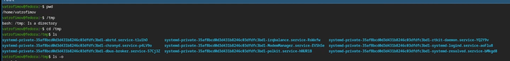
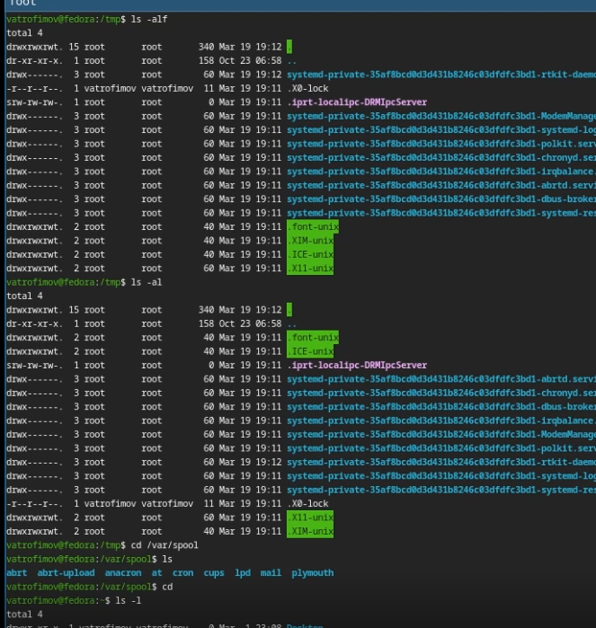
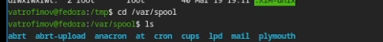
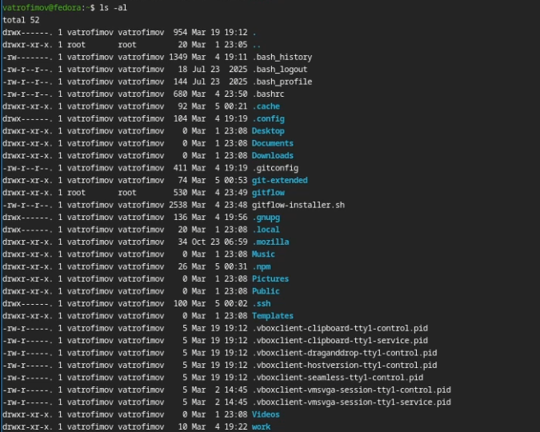
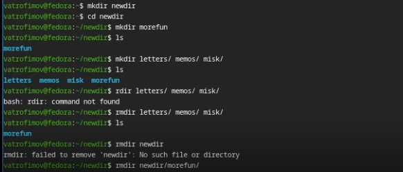
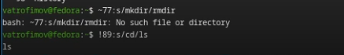

---
## Front matter
lang: ru-RU
title: Лабораторная работа №6
subtitle: Основы интерфейса взаимодействия пользователя с системой Unix
author:
  - Трофимов В. А.
institute:
  - Российский университет дружбы народов, Москва, Россия
date: 05 марта 2026

## i18n babel
babel-lang: russian
babel-otherlangs: english

## Fonts
mainfont: Times New Roman
sansfont: Times New Roman
monofont: Times New Roman
mathfont: Times New Roman
mainfontoptions: Ligatures=Common,Ligatures=TeX,Scale=0.94
romanfontoptions: Ligatures=Common,Ligatures=TeX,Scale=0.94
sansfontoptions: Ligatures=Common,Ligatures=TeX,Scale=MatchLowercase,Scale=0.94
monofontoptions: Scale=MatchLowercase,Scale=0.94,FakeStretch=0.9
mathfontoptions:

## Formatting pdf
toc: false
toc-title: Содержание
slide_level: 2
aspectratio: 169
section-titles: true
theme: metropolis
header-includes:
 - \metroset{progressbar=frametitle,sectionpage=progressbar,numbering=fraction}
---

# Информация

## Докладчик

:::::::::::::: {.columns align=center}
::: {.column width="70%"}

  * Трофимов Владислав Алексеевич
  * Студент НКАбд-06-25
  * Российский университет дружбы народов
  * [1032253511@rudn.ru](mailto:1032253511@rudn.ru)

:::
::::::::::::::

# Цель работы

Приобретение практических навыков взаимодействия пользователся с системой посредством командной строки. 

# Задание

1. Определите полное имя вашего домашнего каталога. Далее относительно этого каталога будут выполняться последующие упражнения.
2. Выполните следующие действия:
2.1. Перейдите в каталог /tmp.
2.2. Выведите на экран содержимое каталога /tmp. Для этого используйте команду ls с различными опциями. Поясните разницу в выводимой на экран информации.
2.3. Определите, есть ли в каталоге /var/spool подкаталог с именем cron?
2.4. Перейдите в Ваш домашний каталог и выведите на экран его содержимое. Определите, кто является владельцем файлов и подкаталогов?
3. Выполните следующие действия:
3.1. В домашнем каталоге создайте новый каталог с именем newdir.
3.2. В каталоге ~/newdir создайте новый каталог с именем morefun.

## Задание

3.3. В домашнем каталоге создайте одной командой три новых каталога с именами letters, memos, misk. Затем удалите эти каталоги одной командой.
3.4. Попробуйте удалить ранее созданный каталог ~/newdir командой rm. Проверьте, был ли каталог удалён.
3.5. Удалите каталог ~/newdir/morefun из домашнего каталога. Проверьте, был ли каталог удалён.
4. С помощью команды man определите, какую опцию команды ls нужно использовать для просмотра содержимого не только указанного каталога, но и подкаталогов, входящих в него.
5. С помощью команды man определите набор опций команды ls, позволяющий отсортировать по времени последнего изменения выводимый список содержимого каталога с развёрнутым описанием файлов.
6. Используйте команду man для просмотра описания следующих команд: cd, pwd, mkdir, rmdir, rm. Поясните основные опции этих команд.
7. Используя информацию, полученную при помощи команды history, выполните модификацию и исполнение нескольких команд из буфера команд.

# Теоретическое введение

Воперационной системетипа Linux взаимодействие пользователя с системой обычно
осуществляется с помощью командной строки посредством построчного ввода ко
манд.При этомобычноиспользуется командные интерпретаторы языка shell: /bin/sh;
/bin/csh; /bin/ksh.
Формат команды. Командой в операционной системе называется записанный по
специальным правиламтекст(возможно с аргументами),представляющий собой ука
зание на выполнение какой-либо функций (или действий) в операционной системе.
Обычно первым словом идётимя команды,остальнойтекст—аргументы или опции,
конкретизирующиедействие.
Общийформаткомандможнопредставитьследующимобразом:
<имя_команды><разделитель><аргументы>
Команда man. Командаmanиспользуетсядляпросмотра(оперативная помощь) вдиа
логовом режиме руководства (manual) по основным командам операционной системы
типа Linux.
Форматкоманды:
man <команда>
Пример(вывод информацииокомандеman):
1
man man
Дляуправленияпросмотромрезультатавыполнениякомандыmanможноиспользовать
следующие клавиши:–Space—перемещениеподокументунаоднустраницувперёд;
Enter —перемещение подокументу на одну строку вперёд;
q —выходизрежимапросмотраописания.
Команда cd. Командаcdиспользуетсядляперемещенияпофайловойсистемеопера
ционной системытипа Linux.

# Выполнение лабораторной работы

## Путь

Вывожу путь к домашнему каталогу, смотрю содержание каталога tmp. (рис. -@fig:001)

{#fig:001 width=70%}

## Команда ls

Использую команду ls с разными флагами. (рис. -@fig:002)

{#fig:002 width=70%}

## Проверка

Проверяю есть ли подкаталог cron в /var/spool. (рис. -@fig:003)

{#fig:003 width=70%}

## Права доступа

Проверяю права доступа. (рис. -@fig:004)

{#fig:004 width=70%}

## Папки

Работа с папками. (рис. -@fig:005)

{#fig:005 width=70%}

## History

Смотрю историю команд, изменяю их. (рис. -@fig:006)

{#fig:006 width=70%}

# Контрольные вопросы

1. Командная строка (или «консоль») – это текстовый интерфейс между человеком и компьютером, в котором инструкции компьютеру даются путём ввода с клавиатуры текстовых строк (команд). Интерфейс командной строки противопоставляется управлению программами на основе меню, а также различным реализациям графического интерфейса. Команды, введённые пользователем, интерпретируются и выполняются специальной программой — командной оболочкой (или «shell» по-английски).

2. Для определения абсолютного пути к текущему каталогу используется команда pwd (print working directory). Пример (абсолютное имя текущего каталога пользователя dharma): (pwd результат: /afs/dk.sci.pfu.edu.ru/home/d/h/dharma)

3. При помощи команды ls -F. (ls -F install-tl-unx/ newdir/ work/ Видео/ Документы/ Загрузки/ Изображения/ Музыка/ Общедоступные/ ‘Рабочий стол’/ Шаблоны/)

## Контрольные вопросы

4. С помощью команды ls -a. (ls -a . .. .bash_history .bash_logout .bash_profile .bashrc .cache .config .gitconfig .gnupg .lesshst .local .mozilla .pki .texlive2022 .var .vboxclient-clipboard.pid .vboxclient-draganddrop.pid .vboxclient-display-svga-x11.pid .vboxclient-seamless.pid .vscode .wget-hsts Видео Документы Загрузки Изображения install-tl-unx Музыка newdir Общедоступные ‘Рабочий стол’ work Шаблоны)

5. Команда rm используется для удаления файлов и/или каталогов. Чтобы удалить каталог, содержащий файлы, нужно использовать опцию -r. Без указания этой опции команда не будет выполняться (rm -r abc). Если каталог пуст, то можно воспользоваться командой rmdir. Если удаляемый каталог содержит файлы, то команда не будет выполнена — нужно использовать rm -r имя_каталога.

## Контрольные вопросы

6. С помощью команды history.

7. Можно модифицировать команду из выведенного на экран списка при помощи следующей конструкции: !:.s///(!3:s/a/Fls-F)

8. Если требуется выполнить последовательно несколько команд, записанных в одной строке, то для этого используется символ точка с запятой. (cd; ls)

9. Если в заданном контексте встречаются специальные символы (типа «.», «/», «*» и т.д.), надо перед ними поставить символ экранирования (обратный слэш).

## Контрольные вопросы

10. Чтобы вывести на экран подробную информацию о файлах и каталогах, необходимо использовать опцию -l. При этом о каждом файле и каталоге будет выведена следующая информация: – тип файла, – права доступа, – число ссылок, – владелец, – размер, – дата последней ревизии, имя файла или каталога.

11. Относительный путь — это ссылка, указывающая на другие страницы вашего сайта относительно веб-страницы, на которой эта ссылка уже находится. Пример относительного пути: ./docs/files/file.txt Пример абсолютного пути: cd /home/dmbelicheva/work/study

12. С помощью команды help.

13. Клавиша Tab.

# Вывод

Мы преобрали практические навыки взаимодействия с системой посредством командной строки.

# Список литературы{.unnumbered}

::: {#refs}
:::