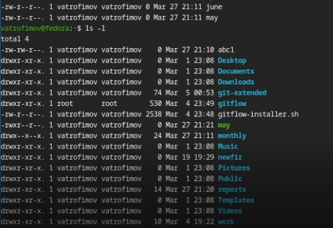
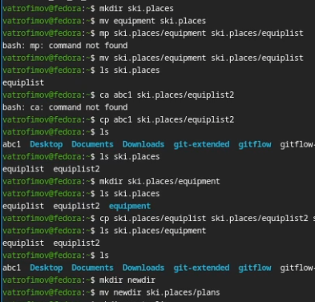
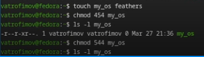
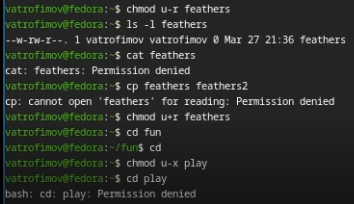
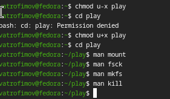

---
## Front matter
lang: ru-RU
title: Лабораторная работа №7
subtitle: Файловая система Linux
author:
  - Трофимов В. А.
institute:
  - Российский университет дружбы народов, Москва, Россия
date: 05 марта 2026

## i18n babel
babel-lang: russian
babel-otherlangs: english

## Fonts
mainfont: Times New Roman
sansfont: Times New Roman
monofont: Times New Roman
mathfont: Times New Roman
mainfontoptions: Ligatures=Common,Ligatures=TeX,Scale=0.94
romanfontoptions: Ligatures=Common,Ligatures=TeX,Scale=0.94
sansfontoptions: Ligatures=Common,Ligatures=TeX,Scale=MatchLowercase,Scale=0.94
monofontoptions: Scale=MatchLowercase,Scale=0.94,FakeStretch=0.9
mathfontoptions:

## Formatting pdf
toc: false
toc-title: Содержание
slide_level: 2
aspectratio: 169
section-titles: true
theme: metropolis
header-includes:
 - \metroset{progressbar=frametitle,sectionpage=progressbar,numbering=fraction}
---

# Информация

## Докладчик

:::::::::::::: {.columns align=center}
::: {.column width="70%"}

  * Трофимов Владислав Алексеевич
  * Студент НКАбд-06-25
  * Российский университет дружбы народов
  * [1032253511@rudn.ru](mailto:1032253511@rudn.ru)

:::
::::::::::::::

# Цель работы

Ознакомление с файловой системой Linux,её структурой,именами и содержанием
каталогов. Приобретение практических навыков по применению команд для работы
с файламиикаталогами,по управлению процессами (и работами),по проверке 
использования диска и обслуживанию файловой системы.

# Задание

1. Выполнитевсепримеры,приведённыевпервойчастиописаниялабораторнойработы.
2. Выполните следующие действия, зафиксировав в отчёте по лабораторной работе
используемые при этом команды ирезультаты их выполнения:
2.1. Скопируйте файл /usr/include/sys/io.h вдомашний каталоги назовите его
equipment.Если файла io.h нет,то используйтелюбойдругой файл в каталоге
/usr/include/sys/ вместо него.
2.2. Вдомашнемкаталоге создайтедиректорию ~/ski.plases.
2.3. Переместите файл equipment в каталог~/ski.plases.
2.4. Переименуйте файл ~/ski.plases/equipment в ~/ski.plases/equiplist.
2.5. Создайте в домашнем каталоге файл abc1 и скопируйте его в каталог
~/ski.plases,назовите его equiplist2.
2.6. Создайте каталог с именем equipment в каталоге ~/ski.plases.
2.7. Переместите файлы ~/ski.plases/equiplist и equiplist2 в каталог
~/ski.plases/equipment.
2.8. Создайте и переместите каталог ~/newdir в каталог ~/ski.plases и назовите
его plans.

## Задание

3. Определите опции команды chmod,необходимыедлятого,чтобы присвоитьперечис
ленным ниже файлам выделенные права доступа,считая,что в начале таких прав
нет:
3.1. drwxr--r--
3.2. drwx--x--x
3.3.-r-xr--r--
3.4.-rw-rw-r--
australia
play
my_os
feathers
Принеобходимости создайте нужные файлы.
4. Проделайте приведённые ниже упражнения, записывая в отчёт по лабораторной
работе используемые при этом команды:
4.1. Просмотрите содержимое файла /etc/password.
4.2. Скопируйте файл ~/feathers в файл ~/file.old.
4.3. Переместите файл ~/file.old в каталог~/play.
4.4. Скопируйте каталог~/play в каталог~/fun.
4.5. Переместите каталог ~/fun в каталог~/play и назовите его games.

## Задание

4.6. Лишите владельца файла ~/feathers права на чтение.
4.7. Что произойдёт,если вы попытаетесьпросмотретьфайл ~/feathers командой
cat?
4.8. Что произойдёт,если вы попытаетесьскопироватьфайл ~/feathers?
4.9. Дайте владельцу файла ~/feathers право на чтение.
4.10. Лишите владельца каталога ~/play права на выполнение.
4.11. Перейдите в каталог~/play.Что произошло?
4.12. Дайте владельцу каталога ~/play право на выполнение.
5. Прочитайте man по командам mount,fsck,mkfs,kill и кратко их охарактеризуйте,
приведя примеры.

# Теоретическое введение

Файловая система в Linux состоитиз фалов и каталогов.Каждому физическому носи
телю соответствует своя файловая система.
Существует несколькотипов файловых систем.Перечислим наиболее часто встречаю
щиесятипы:– ext2fs (second extended filesystem);– ext2fs (third extended file system);– ext4(fourth extended file system);– ReiserFS;– xfs;– fat (file allocation table);– ntfs (new technology file system).
Для просмотра используемых в операционной системе файловых систем можно вос
пользоваться командой mount без параметров.

# Выполнение лабораторной работы

## Примеры

Повторяю примеры приведенные в лабораторной работе. (рис. -@fig:001)

{#fig:001 width=70%}

## Работа с командами

Работаю с командами mv и cp. (рис. -@fig:002)

{#fig:002 width=70%}

## Права доступа

Меняю права доступа для файлов и катологов. (рис. -@fig:003)

{#fig:003 width=70%}

## Изменение прав

Проверка изменных прав. (рис. -@fig:004)

{#fig:004 width=70%}

## Документация

Документация по командам. (рис. -@fig:005)

{#fig:005 width=70%}

# Контрольные вопросы

1. Дайте характеристику каждой файловой системе, существующей на жёстком диске компьютера, на котором вы выполняли лабораторную работу.
Ext2, Ext3, Ext4 или Extended Filesystem - это стандартная файловая система для Linux. Она была разработана еще для Minix. Она самая стабильная из всех существующих, кодовая база изменяется очень редко и эта файловая система содержит больше всего функций. Версия ext2 была разработана уже именно для Linux и получила много улучшений. В 2001 году вышла ext3, которая добавила еще больше стабильности благодаря использованию журналирования. В 2006 была выпущена версия ext4, которая используется во всех дистрибутивах Linux до сегодняшнего дня. В ней было внесено много улучшений, в том числе увеличен максимальный размер раздела до одного экзабайта.

## Контрольные вопросы

NTFS — это файловая система по умолчанию, используемая операционными системами на базе Windows NT, начиная с 1993 года с Windows NT 3.1 и вплоть до Windows 11 включительно. Она предлагает расширенные функции, такие как права доступа к файлам, шифрование, сжатие и ведение журнала.

2. Приведите общую структуру файловой системы и дайте характеристику каждой директории первого уровня этой структуры.

/ — root каталог. Содержит в себе всю иерархию системы;

/bin — здесь находятся двоичные исполняемые файлы. Основные общие команды, хранящиеся отдельно от других программ в системе (прим.: pwd, ls, cat, ps);

/boot — тут расположены файлы, используемые для загрузки системы (образ initrd, ядро vmlinuz);

/dev — в данной директории располагаются файлы устройств (драйверов). С помощью этих файлов можно взаимодействовать с устройствами. К примеру, если это жесткий диск, можно подключить его к файловой системе. В файл принтера же можно написать напрямую и отправить задание на печать;

## Контрольные вопросы

/etc — в этой директории находятся файлы конфигураций программ. Эти файлы позволяют настраивать системы, сервисы, скрипты системных демонов;

/home — каталог, аналогичный каталогу Users в Windows. Содержит домашние каталоги учетных записей пользователей (кроме root). При создании нового пользователя здесь создается одноименный каталог с аналогичным именем и хранит личные файлы этого пользователя;

/lib — содержит системные библиотеки, с которыми работают программы и модули ядра;

/lost+found — содержит файлы, восстановленные после сбоя работы системы. Система проведет проверку после сбоя и найденные файлы можно будет посмотреть в данном каталоге;

/media — точка монтирования внешних носителей. Например, когда вы вставляете диск в дисковод, он будет автоматически смонтирован в директорию /media/cdrom;

/mnt — точка временного монтирования. Файловые системы подключаемых устройств обычно монтируются в этот каталог для временного использования;

## Контрольные вопросы

/opt — тут расположены дополнительные (необязательные) приложения. Такие программы обычно не подчиняются принятой иерархии и хранят свои файлы в одном подкаталоге (бинарные, библиотеки, конфигурации);

/proc — содержит файлы, хранящие информацию о запущенных процессах и о состоянии ядра ОС;

/root — директория, которая содержит файлы и личные настройки суперпользователя;

/run — содержит файлы состояния приложений. Например, PID-файлы или UNIX-сокеты;

/sbin — аналогично /bin содержит бинарные файлы. Утилиты нужны для настройки и администрирования системы суперпользователем;

## Контрольные вопросы

/srv — содержит файлы сервисов, предоставляемых сервером (прим. FTP или Apache HTTP);

/sys — содержит данные непосредственно о системе. Тут можно узнать информацию о ядре, драйверах и устройствах;

/tmp — содержит временные файлы. Данные файлы доступны всем пользователям на чтение и запись. Стоит отметить, что данный каталог очищается при перезагрузке;

/usr — содержит пользовательские приложения и утилиты второго уровня, используемые пользователями, а не системой. Содержимое доступно только для чтения (кроме root). Каталог имеет вторичную иерархию и похож на корневой;

/var — содержит переменные файлы. Имеет подкаталоги, отвечающие за отдельные переменные. Например, логи будут храниться в /var/log, кэш в /var/cache, очереди заданий в /var/spool/ и так далее.

## Контрольные вопросы

3. Какая операция должна быть выполнена, чтобы содержимое некоторой файловой системы было доступно операционной системе? Монтирование тома.

4. Назовите основные причины нарушения целостности файловой системы. Как устранить повреждения файловой системы? Отсутствие синхронизации между образом файловой системы в памяти и ее данными на диске в случае аварийного останова может привести к появлению следующих ошибок:

    Один блок адресуется несколькими mode (принадлежит нескольким файлам).

    Блок помечен как свободный, но в то же время занят (на него ссылается onode).

    Блок помечен как занятый, но в то же время свободен (ни один inode на него не ссылается).

    Неправильное число ссылок в inode (недостаток или избыток ссылающихся записей в каталогах).

    Несовпадение между размером файла и суммарным размером адресуемых inode блоков.

    Недопустимые адресуемые блоки (например, расположенные за пределами файловой системы).

    "Потерянные" файлы (правильные inode, на которые не ссылаются записи каталогов).

    Недопустимые или неразмещенные номера inode в записях каталогов.

## Контрольные вопросы

5. Как создаётся файловая система?

mkfs - позволяет создать файловую систему Linux.

6. Дайте характеристику командам для просмотра текстовых файлов.

Cat - выводит содержимое файла на стандартное устройство вывода

7. Приведите основные возможности команды cp в Linux.

## Контрольные вопросы

Cp – копирует или перемещает директорию, файлы.

8. Приведите основные возможности команды mv в Linux.

Mv - переименовать или переместить файл или директорию

9. Что такое права доступа? Как они могут быть изменены?

Права доступа к файлу или каталогу можно изменить, воспользовавшись командой chmod. Сделать это может владелец файла (или каталога) или пользователь с правами администратора.

# Вывод

Мы ознакомились с файловой системой Linux, ее структурой, именами и содержанием каталогов. Приобрели практические навыки по применению команд для работы с файлами и каталогами.

# Список литературы{.unnumbered}

::: {#refs}
:::