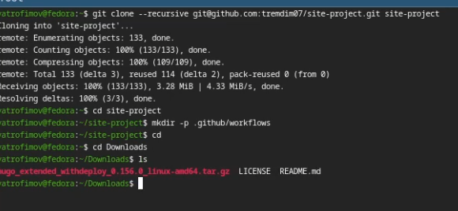
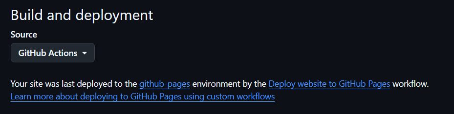
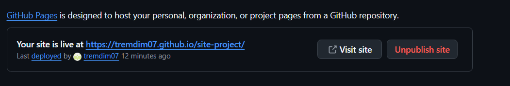

---
## Front matter
lang: ru-RU
title: Индивидуальный проект этап 1
subtitle: Github pages
author:
  - Трофимов В. А.
institute:
  - Российский университет дружбы народов, Москва, Россия
date: 05 марта 2026

## i18n babel
babel-lang: russian
babel-otherlangs: english

## Fonts
mainfont: Times New Roman
sansfont: Times New Roman
monofont: Times New Roman
mathfont: Times New Roman
mainfontoptions: Ligatures=Common,Ligatures=TeX,Scale=0.94
romanfontoptions: Ligatures=Common,Ligatures=TeX,Scale=0.94
sansfontoptions: Ligatures=Common,Ligatures=TeX,Scale=MatchLowercase,Scale=0.94
monofontoptions: Scale=MatchLowercase,Scale=0.94,FakeStretch=0.9
mathfontoptions:

## Formatting pdf
toc: false
toc-title: Содержание
slide_level: 2
aspectratio: 169
section-titles: true
theme: metropolis
header-includes:
 - \metroset{progressbar=frametitle,sectionpage=progressbar,numbering=fraction}
---

# Информация

# Докладчик

:::::::::::::: {.columns align=center}
::: {.column width="70%"}

  * Трофимов Владислав Алексеевич
  * Студент НКАбд-06-25
  * Российский университет дружбы народов
  * [1032253511@rudn.ru](mailto:1032253511@rudn.ru)

:::
::::::::::::::

# Цель работы

Научиться размещать сайт на github pages и выполнить первый этап проекта.

# Задание

- Установка необходимого ПО
- Скачивание шаблона сайта
- Размещение его на хостинге Git
- Установка параметра для URL сайта
- Размещение сайта на github pages

# Выполнение проекта

## Hugo

устанавливаю hugo на виртуальную машину и распаковываю архив. (рис. -@fig:001)

{#fig:001 width=70%}

## Создание репозитория

Создаю свой репозиторий для будущего сайта по шаблону. (рис. -@fig:002)

{#fig:002 width=70%}

## Конфигурация

Клонирую репозиторий на свою машину и загружаю туда конфигурационный файл для сайта. (рис. -@fig:003)

{#fig:003 width=70%}

## Push

Делаю снимок изменений, создаю коммит и пушу изменения на гитхаб. (рис. -@fig:004)

{#fig:004 width=70%}

## Настройка

В настройка репозитория выбираю github actions. (рис. -@fig:005)

{#fig:005 width=70%}

## Проверка

Проверка работоспособности. (рис. -@fig:006)

{#fig:006 width=70%}

# Выводы 

Я научился размещать сайт на Github pages, выполнил первый этап проекта.

# Список литературы{.unnumbered}

::: {#refs}
:::