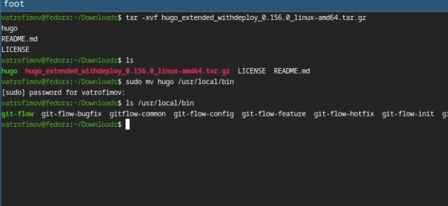
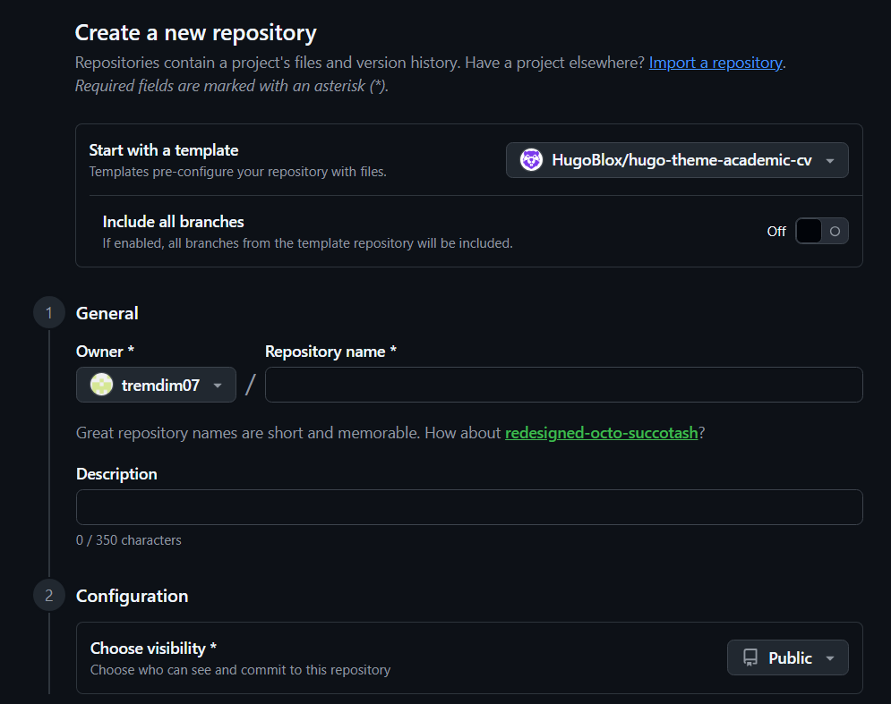
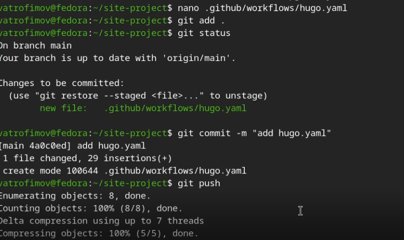

---
## Front matter
title: "Индивидуальный проект этап 1"
subtitle: "дисциплина: Архитектура компьютера"
author: "Трофимов Владислав Алексеевич"

## Generic otions
lang: ru-RU\
toc-title: "Содержание"

## Bibliography
bibliography: bib/cite.bib
csl: pandoc/csl/gost-r-7-0-5-2008-numeric.csl

## Pdf output format
toc: true # Table of contents
toc-depth: 2
lof: true # List of figures
lot: true # List of tables
fontsize: 13pt
linestretch: 1.5
papersize: a4
documentclass: scrreprt
## I18n polyglossia
polyglossia-lang:
  name: russian
  options:
    - spelling=modern
    - babelshorthands=true
polyglossia-otherlangs:
  name: english
## I18n babel
babel-lang: russian
babel-otherlangs: english
## Fonts
mainfont: Times New Roman
sansfont: Times New Roman
monofont: Times New Roman
mathfont: Times New Roman
mainfontoptions: Ligatures=Common,Ligatures=TeX,Scale=0.94
romanfontoptions: Ligatures=Common,Ligatures=TeX,Scale=0.94
sansfontoptions: Ligatures=Common,Ligatures=TeX,Scale=MatchLowercase,Scale=0.94
monofontoptions: Scale=MatchLowercase,Scale=0.94,FakeStretch=0.9
mathfontoptions:
## Biblatex
biblatex: true
biblio-style: "gost-numeric"
biblatexoptions:
  - parentracker=true
  - backend=biber
  - hyperref=auto
  - language=auto
  - autolang=other*
  - citestyle=gost-numeric
## Pandoc-crossref LaTeX customization
figureTitle: "Рис."
tableTitle: "Таблица"
listingTitle: "Листинг"
lofTitle: "Список иллюстраций"
lotTitle: "Список таблиц"
lolTitle: "Листинги"
## Misc options
indent: true
header-includes:
  - \usepackage{indentfirst}
  - \usepackage{float} # keep figures where there are in the text
  - \floatplacement{figure}{H} # keep figures where there are in the text
---

# Цель работы

Научиться размещать сайт на github pages и выполнить первый этап проекта.

# Задание

- Установка необходимого ПО
- Скачивание шаблона сайта
- Размещение его на хочтинге Git
- Установка параметра для URL сайта
- Размещение сайта на github pages

# Выполнение проекта

устанавливаю hugo на виртуальную машину и распаковываю архив. (рис. -@fig:001)

{#fig:001 width=70%}

Создаю свой репозиторий для будущего сайта по шаблону. (рис. -@fig:002)

{#fig:002 width=70%}

Клонирую репозиторий на свою машину и загружаю туда конфигурационный файл для сайта. (рис. -@fig:003)

{#fig:003 width=70%}

Делаю снимок изменений, создаю коммит и пушу изменения на гитхаб. (рис. -@fig:004)

{#fig:004 width=70%}

В настройка репозитория выбираю github actions. (рис. -@fig:005)

{#fig:005 width=70%}

Проверка работоспособности. (рис. -@fig:006)

{#fig:006 width=70%}

# Выводы 

Я научился размещать сайт на Github pages, выполнил первый этап проекта.

# Список литературы{.unnumbered}

::: {#refs}
:::