---
## Front matter
title: "Внешние курсы этап 1"
subtitle: "дисциплина: Архитектура компьютера"
author: "Трофимов Владислав Алексеевич"

## Generic otions
lang: ru-RU\
toc-title: "Содержание"

## Bibliography
bibliography: bib/cite.bib
csl: pandoc/csl/gost-r-7-0-5-2008-numeric.csl

## Pdf output format
toc: true # Table of contents
toc-depth: 2
lof: true # List of figures
lot: true # List of tables
fontsize: 13pt
linestretch: 1.5
papersize: a4
documentclass: scrreprt
## I18n polyglossia
polyglossia-lang:
  name: russian
  options:
    - spelling=modern
    - babelshorthands=true
polyglossia-otherlangs:
  name: english
## I18n babel
babel-lang: russian
babel-otherlangs: english
## Fonts
mainfont: Times New Roman
sansfont: Times New Roman
monofont: Times New Roman
mathfont: Times New Roman
mainfontoptions: Ligatures=Common,Ligatures=TeX,Scale=0.94
romanfontoptions: Ligatures=Common,Ligatures=TeX,Scale=0.94
sansfontoptions: Ligatures=Common,Ligatures=TeX,Scale=MatchLowercase,Scale=0.94
monofontoptions: Scale=MatchLowercase,Scale=0.94,FakeStretch=0.9
mathfontoptions:
## Biblatex
biblatex: true
biblio-style: "gost-numeric"
biblatexoptions:
  - parentracker=true
  - backend=biber
  - hyperref=auto
  - language=auto
  - autolang=other*
  - citestyle=gost-numeric
## Pandoc-crossref LaTeX customization
figureTitle: "Рис."
tableTitle: "Таблица"
listingTitle: "Листинг"
lofTitle: "Список иллюстраций"
lotTitle: "Список таблиц"
lolTitle: "Листинги"
## Misc options
indent: true
header-includes:
  - \usepackage{indentfirst}
  - \usepackage{float} # keep figures where there are in the text
  - \floatplacement{figure}{H} # keep figures where there are in the text
---

# Цель работы

Ознакомиться с функцианалом операционной системы Linux

# Задание

Изучить теоретическую часть курса "Введение в Linux" и пройти задания

# Теоретическое введение

Linux (в части случаев GNU/Linux) — семейство Unix-подобных операционных систем с открытым исходным кодом. В рамках данного этапа рассматриваются базовые понятия: работа в командной строке, управление пакетами, перенаправление потоков, архивация, загрузка файлов и т.д.

# Выполнение лабораторной работы

Курс называется "Введение в Linux", поэтому легко выполняем первое задание. (рис. -@fig:001)

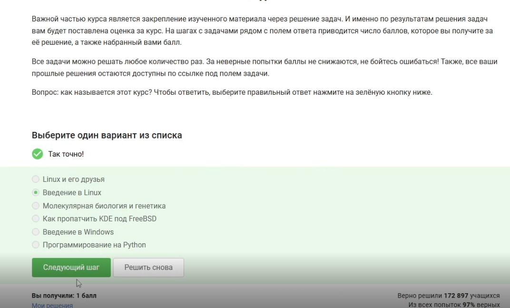{#fig:001 width=70%}

## Задание 2

Прочитав критерии прохождения курса, я отметил необходимые утверждения. (рис. -@fig:002)

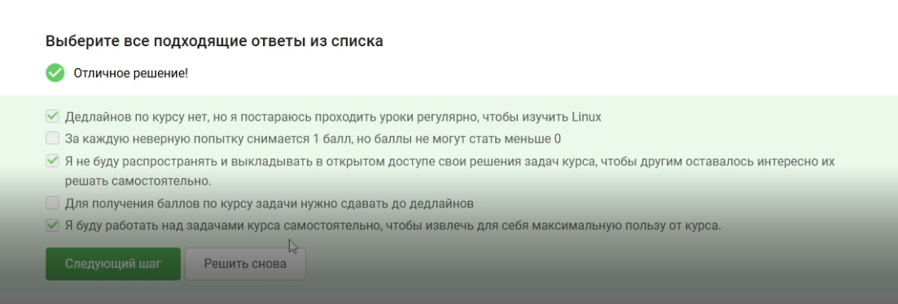{#fig:002 width=70%}

## Задание 3

Стандартная операционная система, предлагаемая большей частью магазинов — Windows. (рис. -@fig:003)

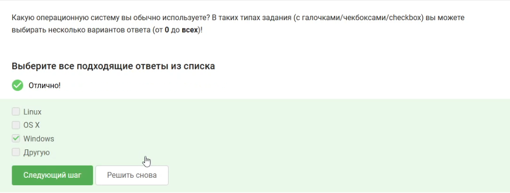{#fig:003 width=70%}

## Задание 4

На свой компьютер мы устанавливали специальную программу VirtualBox, которая нужна для запуска одной операционной системы внутри другой. (рис. -@fig:004)

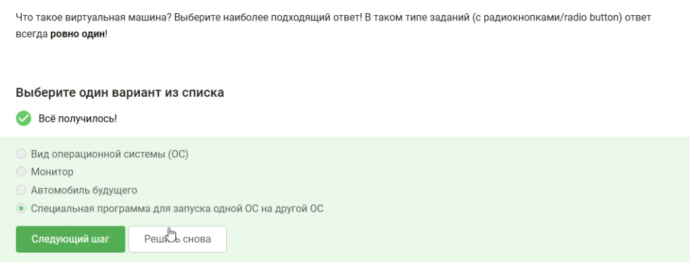{#fig:004 width=70%}

## Задание 5

Моя виртуальная машина работает. (рис. -@fig:005)

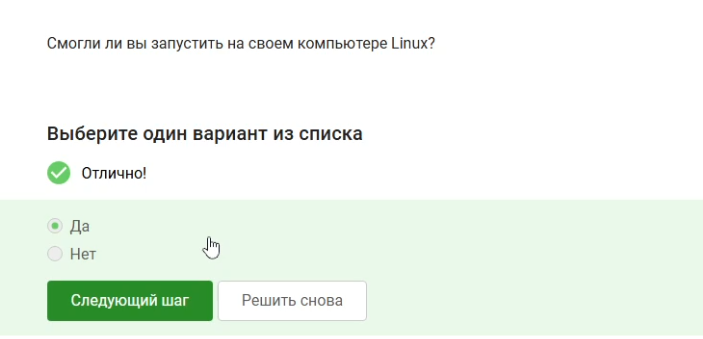{#fig:005 width=70%}

## Задание 6

Я создал документ, выбрал нужный формат и прикрепил его. (рис. -@fig:006)

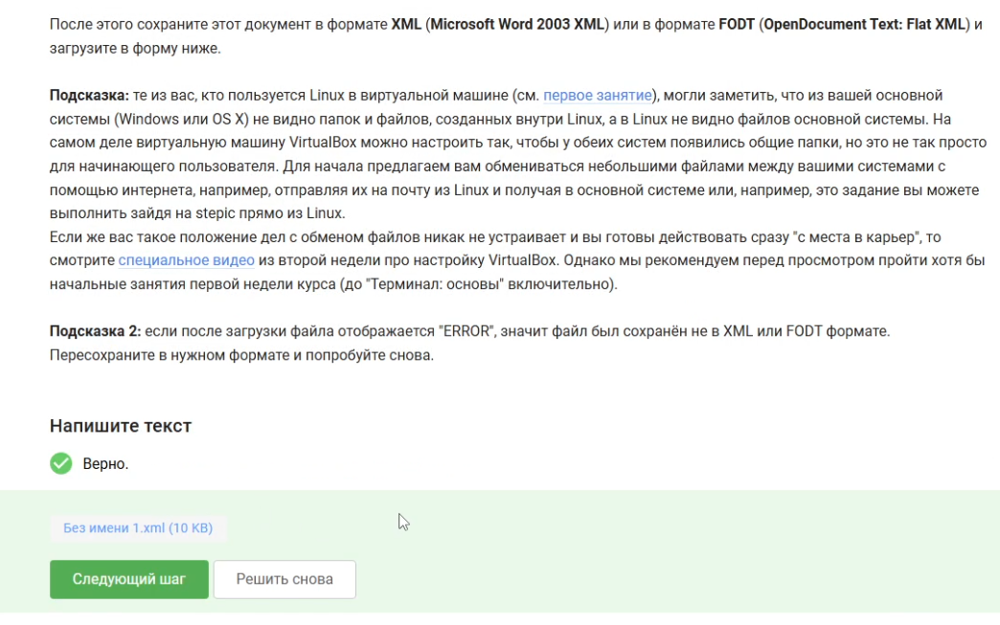{#fig:006 width=70%}

## Задание 7

deb — формат пакетов операционных систем проекта Debian (используется также Ubuntu, Knoprix и другими). (рис. -@fig:007)

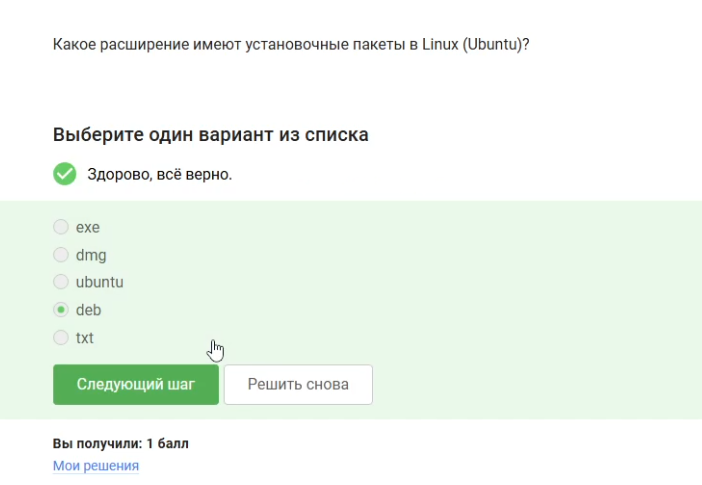{#fig:007 width=70%}

## Задание 8

Установив медиапроигрыватель, я посмотрел авторов программы и записал первую фамилию. (рис. -@fig:008)

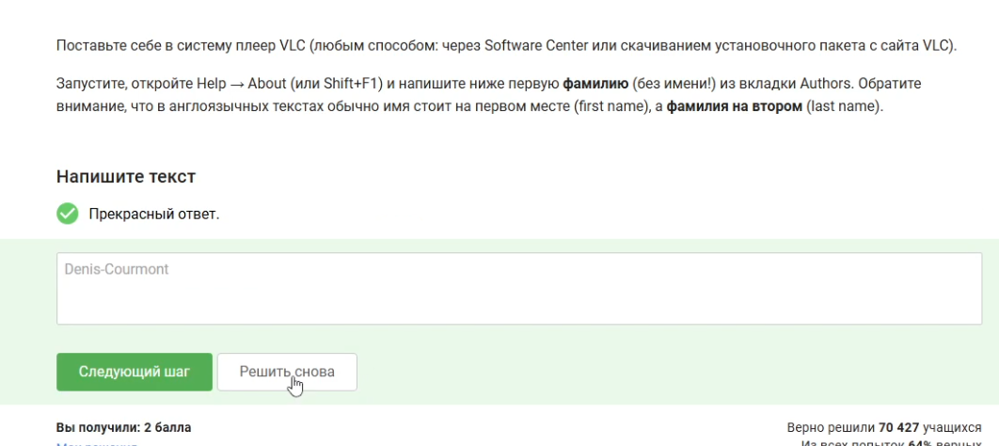{#fig:008 width=70%}

## Задание 9

Менеджер обновлений — программа для обновления ПО в дистрибутивах Linux на основе Debian. (рис. -@fig:009)

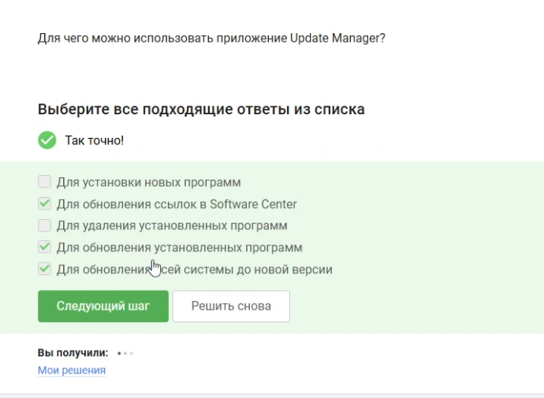{#fig:009 width=70%}

## Задание 10

Ассоль — героиня литературного произведения, а «термин» — это определение. (рис. -@fig:010)

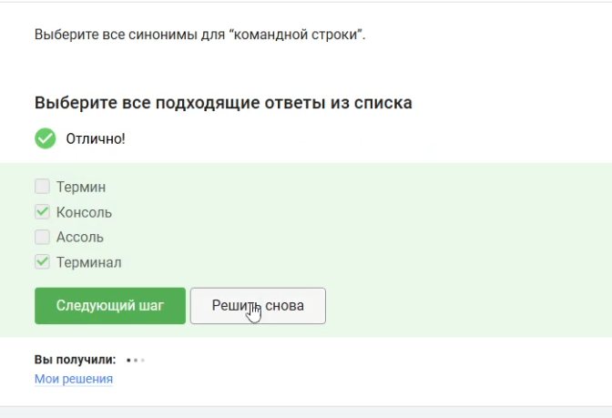{#fig:010 width=70%}

## Задание 11

Интерфейс командной строки Linux является регистрозависимым. (рис. -@fig:011)

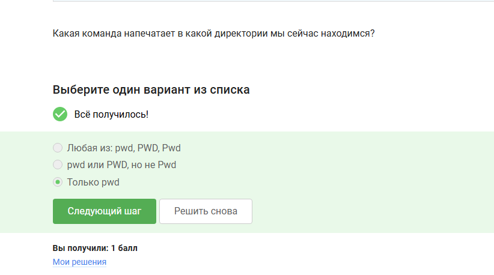{#fig:011 width=70%}

## Задание 12

Из-за регистрозависимости не подходит вариант, где буква «А» строчная. (рис. -@fig:012)

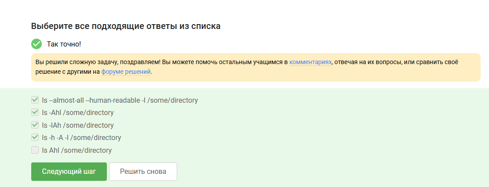{#fig:012 width=70%}

## Задание 13

Я прописываю полный путь до Downloads, так как нахожусь в другой директории. (рис. -@fig:013)

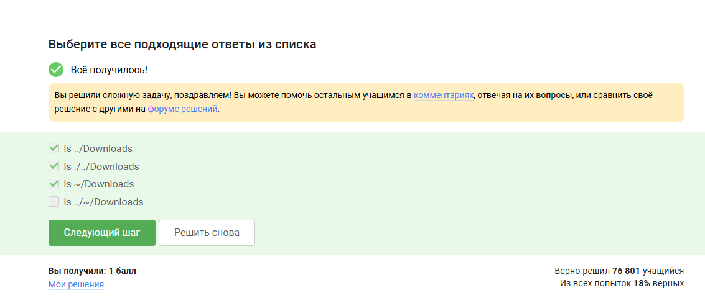{#fig:013 width=70%}

## Задание 14

ls ../Downloads, ls ./../Downloads, ls ~/Downloads — допустимые варианты. ls ./../Downloads не подходит из-за неверного синтаксиса пути. (рис. -@fig:014)

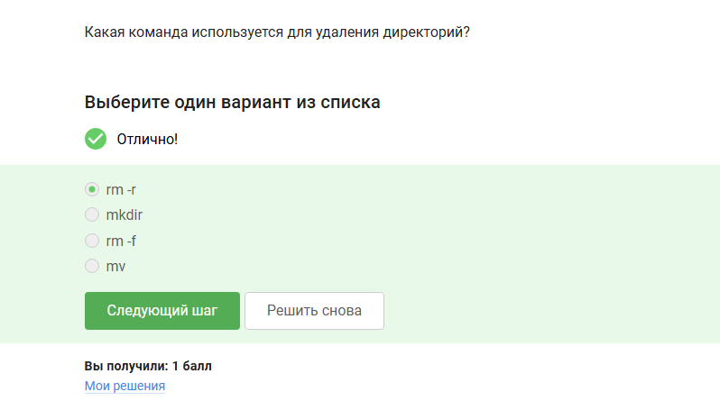{#fig:014 width=70%}

## Задание 15

rm -r — удаление директории и рекурсивное удаление файлов внутри. (рис. -@fig:015)

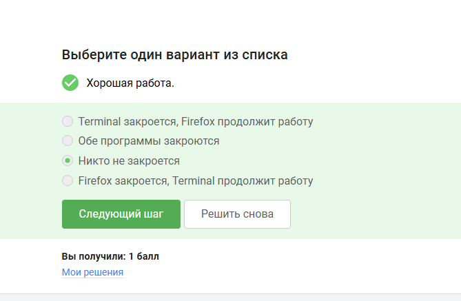{#fig:015 width=70%}

## Задание 16

Это запуск программы в фоновом режиме. (рис. -@fig:016)

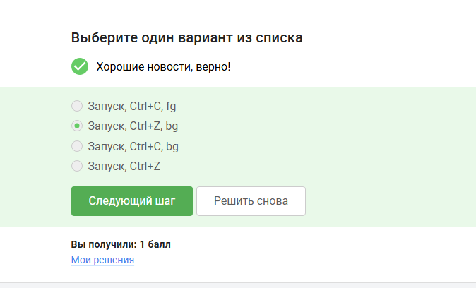{#fig:016 width=70%}

## Задание 17

Это выполненные мной команды. (рис. -@fig:017)

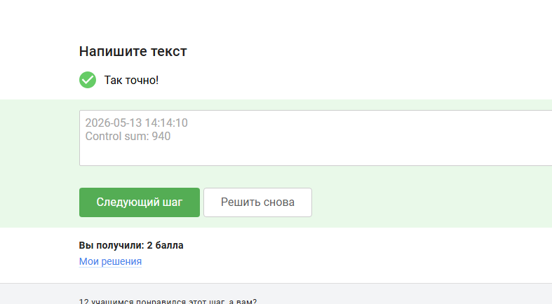{#fig:017 width=70%}

## Задание 18

Автоматически поток ошибок выводится на экран. В файл он будет направлен только после перенаправления. (рис. -@fig:018)

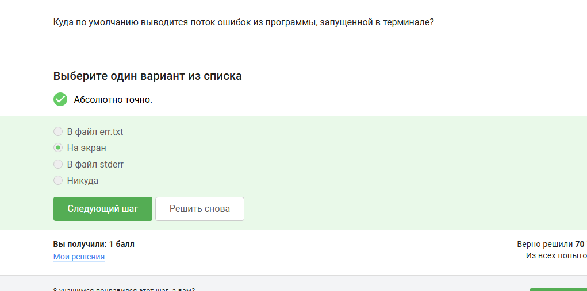{#fig:018 width=70%}

## Задание 19

Сообщения об ошибках (stderr) от программ, объединённых в конвейер, выводятся на экран — они не передаются по pipe следующей программе. (рис. -@fig:019)

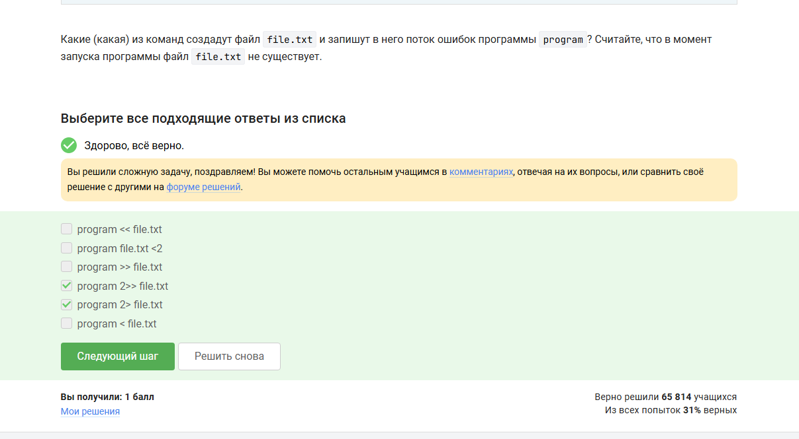{#fig:019 width=70%}

## Задание 20

При выполнении команд `cd /home/alex/` и `wget -P /home/alex/Pictures -O 1.jpg http://example.com/example.jpg` файл сохраняется как `/home/alex/1.jpg`, так как флаг `-O` задаёт имя файла и перекрывает путь, указанный в `-P`. (рис. -@fig:020)

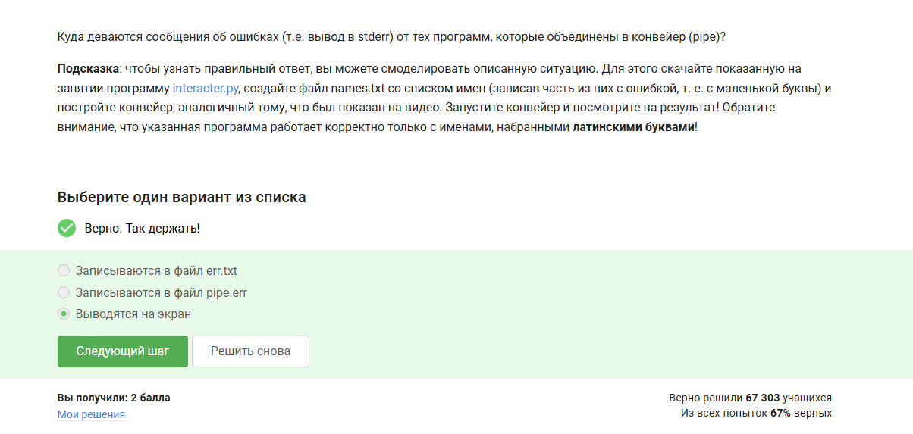{#fig:020 width=70%}

## Задание 21

`-q` или `--quiet` — опция, отключающая вывод любых сообщений команды `wget` на экран. (рис. -@fig:021)

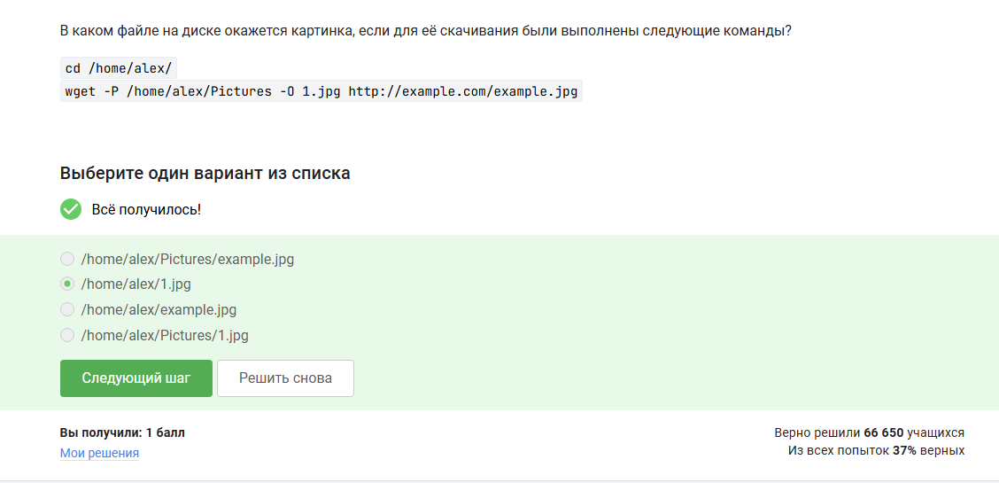{#fig:021 width=70%}

## Задание 22

При запуске `wget -r -l 1 -A jpg` будут скачаны jpg и html файлы, но все html будут удалены — wget скачивает html для обхода ссылок, но затем удаляет их, оставляя только файлы нужного типа. (рис. -@fig:022)

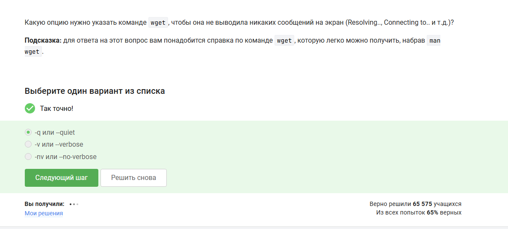{#fig:022 width=70%}

## Задание 23

Команды `program 2>> file.txt` и `program 2> file.txt` создадут файл `file.txt` и запишут в него поток ошибок программы `program`. (рис. -@fig:023)

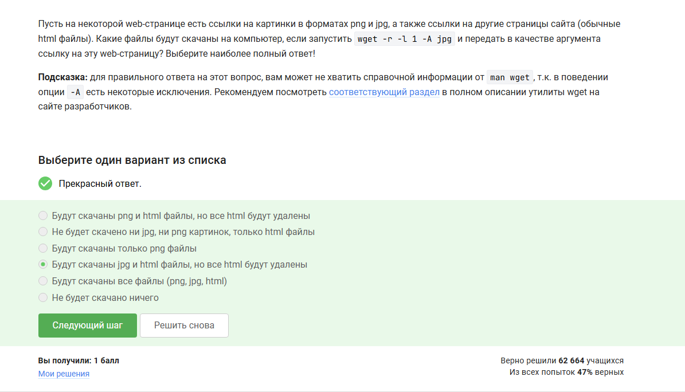{#fig:023 width=70%}

## Задание 24

Я скачал архив с произведениями Шекспира, с помощью `grep` нашёл все строки, содержащие «love», и перенаправил вывод в файл. (рис. -@fig:024)

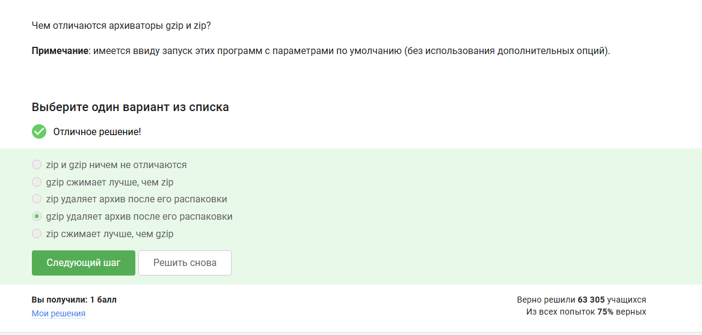{#fig:024 width=70%}

## Задание 25

gzip удаляет исходный файл после его распаковки, в отличие от zip, который оставляет архив нетронутым. (рис. -@fig:025)

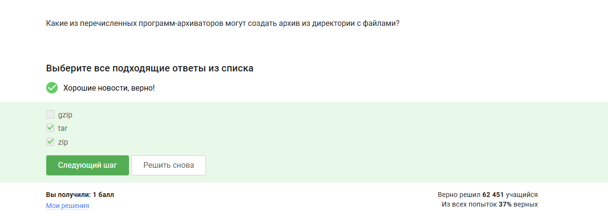{#fig:025 width=70%}

## Задание 26

Из перечисленных архиваторов создать архив из директории с файлами могут tar и zip; gzip работает только с отдельными файлами. (рис. -@fig:026)

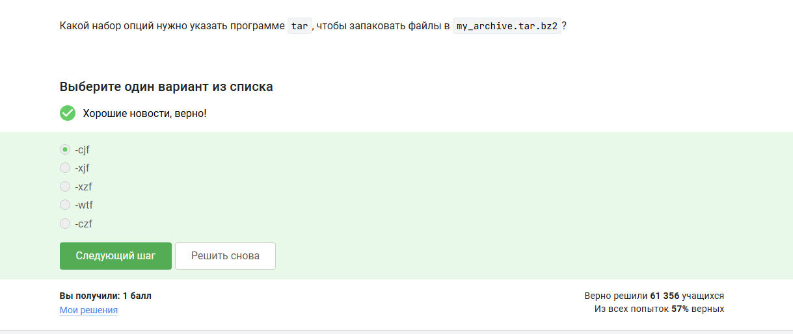{#fig:026 width=70%}

## Задание 27

Для упаковки файлов в `my_archive.tar.bz2` программе tar нужно указать набор опций `-cjf`: c — создание архива, j — сжатие bzip2, f — указание имени файла. (рис. -@fig:027)

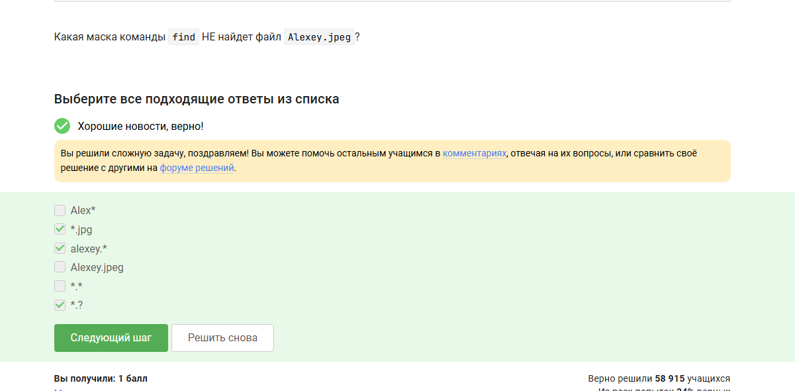{#fig:027 width=70%}

## Задание 28

Маски `*.jpg`, `alexey.*` и `*.?` НЕ найдут файл `Alexey.jpeg`: первая ищет расширение jpg, вторая — строчную букву в начале, третья — расширение из одного символа. (рис. -@fig:028)

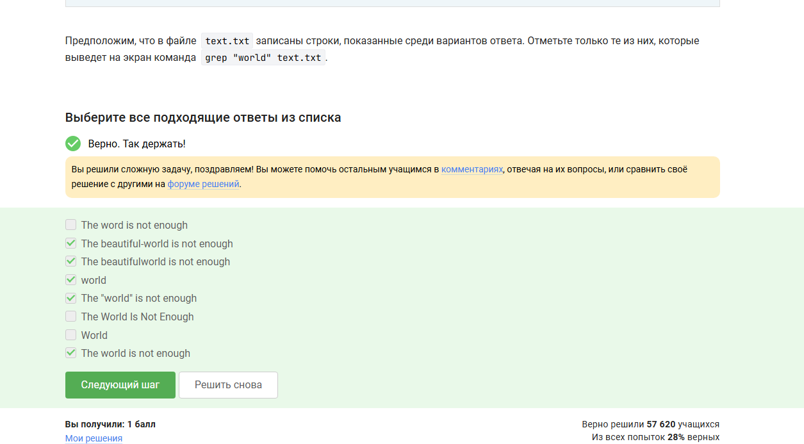{#fig:028 width=70%}

## Задание 29

Регистр — строчная буква, слово — world. Команда `grep "world" text.txt` выведет только строки, содержащие «world» в нижнем регистре. (рис. -@fig:029)

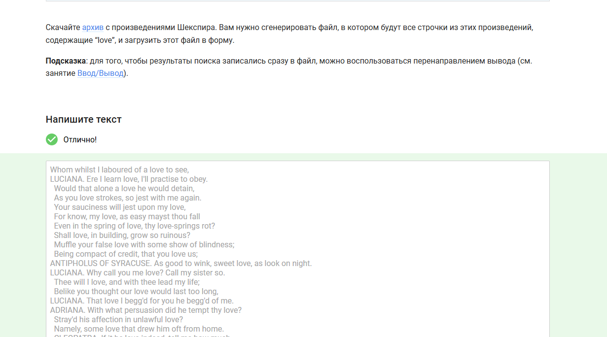{#fig:029 width=70%}

# Выводы

Я просмотрел курс «Введение в Linux» и освоил навыки работы с: командной строкой (регистрозависимость, пути, перенаправление потоков), пакетными менеджерами (формат deb), загрузкой файлов (wget, ключи -P, -O, -q, -A), архивацией (tar с ключами cjf), регулярными выражениями (?, учёт регистра, типы файлов)

Все 29 заданий успешно выполнены.

# Список литературы{.unnumbered}

::: {#refs}
:::
