---
## Front matter
lang: ru-RU
title: "Внешние курсы этап 2"
subtitle: "дисциплина: Архитектура компьютера"
author:
  - Трофимов В. А.
institute:
  - Российский университет дружбы народов, Москва, Россия
date: 05 марта 2026

## i18n babel
babel-lang: russian
babel-otherlangs: english

## Fonts
mainfont: Times New Roman
sansfont: Times New Roman
monofont: Times New Roman
mathfont: Times New Roman
mainfontoptions: Ligatures=Common,Ligatures=TeX,Scale=0.94
romanfontoptions: Ligatures=Common,Ligatures=TeX,Scale=0.94
sansfontoptions: Ligatures=Common,Ligatures=TeX,Scale=MatchLowercase,Scale=0.94
monofontoptions: Scale=MatchLowercase,Scale=0.94,FakeStretch=0.9
mathfontoptions:

## Formatting pdf
toc: false
toc-title: Содержание
slide_level: 2
aspectratio: 169
section-titles: true
theme: metropolis
header-includes:
 - \metroset{progressbar=frametitle,sectionpage=progressbar,numbering=fraction}
---

# Цель работы

Ознакомиться с принципами работы на удаленный серверах: способами подключения, передачей файлов, управлением процессами и многопоточными вычислениями в OC Linux.

# Задание

Изучить теоретическую часть курса "Введение в Linux" и выполнить задания

# Теоретическое введение

Удалённый сервер - это компьютер, доступный по сети, на котором можно выполнять ресурсоёмкие вычисления, хранить большие объёмы данных и запускать специализированные программы. Для подключения к серверу используется протокол SSH (Secure Shell), обеспечивающий зашифрованный канал связи. Аутентификация выполняется по паролю или по паре ключей RSA: публичный ключ (`id_rsa.pub`) размещается на сервере, приватный (`id_rsa`) хранится локально и никогда не передаётся. Для копирования файлов применяется команда `scp`, для графической работы с файловой системой сервера - программа FileZilla. Управление процессами осуществляется командами `jobs`, `fg`, `bg`, `kill`, `top` и `ps`. Многопоточные приложения позволяют задействовать несколько ядер процессора одновременно, что существенно ускоряет вычисления. Терминальный мультиплексор `tmux` позволяет запускать несколько сессий в одном окне терминала и сохранять сеансы при разрыве соединения.

# Выполнение лабораторной работы

## Задание 1

Удаленный сервер подходит для широкого круга задач: сложных вычислений, хранения данных. (рис. -@fig:001)

{#fig:001 width=70%}

## Задание 2

По интернету безопасно можно пересылать только публичный ключ `id_rsa.pub` - он предназначен для открытого распространения. Приватный ключ `id_rsa` должен оставаться только на локальной машине: его компрометация означает полную утрату безопасности. (рис. -@fig:002)

{#fig:002 width=70%}

## Задание 3

Для рекурсивного копирования папки `stepic` вместе со всем её содержимым на сервер используется `scp -r stepic username@server:~/`. Флаг `-r` обеспечивает рекурсивный обход подпапок, а `~/` указывает домашнюю директорию на сервере. (рис. -@fig:003)

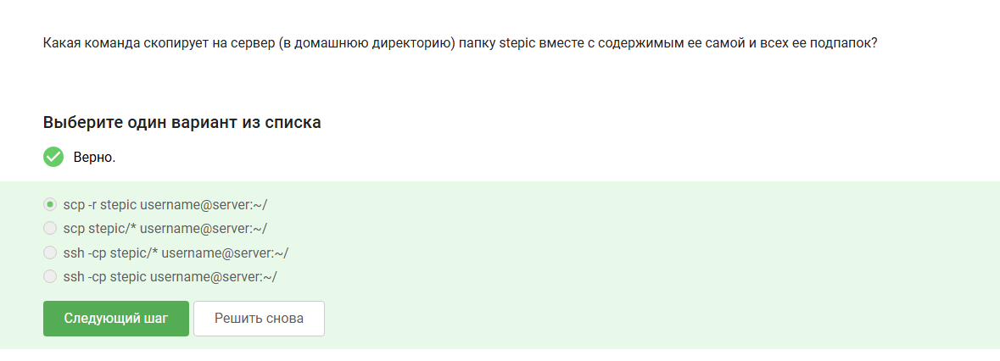{#fig:003 width=70%}

## Задание 4

Если `sudo apt-get install program` не может найти пакет, нужно выполнить `sudo apt-get update` (обновить список доступных пакетов) и проверить наличие интернет-соединения. Команда `upgrade` обновляет уже установленные пакеты, а `--only-upgrade` не поможет при отсутствии пакета в списке. (рис. -@fig:004)

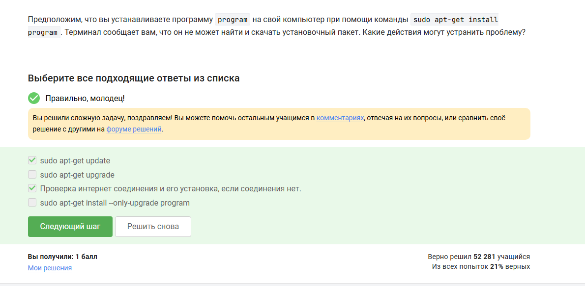{#fig:004 width=70%}

## Задание 5

FileZilla позволяет копировать файлы с сервера на компьютер и обратно, а также просматривать содержимое директорий на сервере. Устанавливать программы или запускать их на сервере через FileZilla нельзя - это FTP/SFTP-клиент, а не инструмент управления процессами. (рис. -@fig:005)

{#fig:005 width=70%}

## Задание 6

Если программе на сервере нужен экран (графический интерфейс), можно либо настроить сервер на поддержку вывода на экран клиентского компьютера (X11 forwarding), либо поискать терминальную версию этой программы. Запустить её локально или не делать ничего - не решение задачи. (рис. -@fig:006)

{#fig:006 width=70%}

## Задание 7

Справочную информацию о программе можно получить командами `program --help` (или `-h`), `help program` и `man program`. Вариант `program ?!` не является стандартным способом вызова справки ни в одной из распространённых утилит Linux. (рис. -@fig:007)

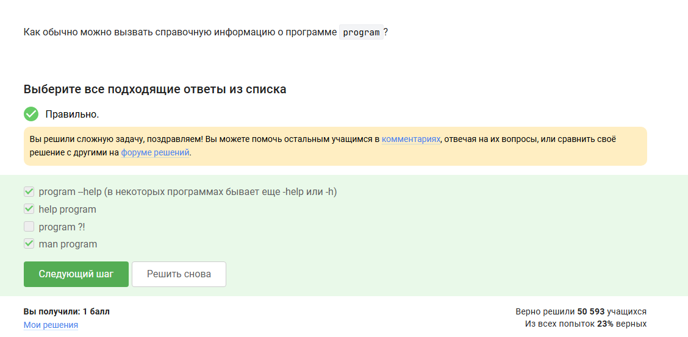{#fig:007 width=70%}

## Задание 8

Программа FastQC принимает на вход файлы форматов `fastq` и `bam_mapped`/`sam_mapped`. Форматы `fasta` и `seq` FastQC не обрабатывает - они предназначены для хранения последовательностей без информации о качестве ридов. (рис. -@fig:008)

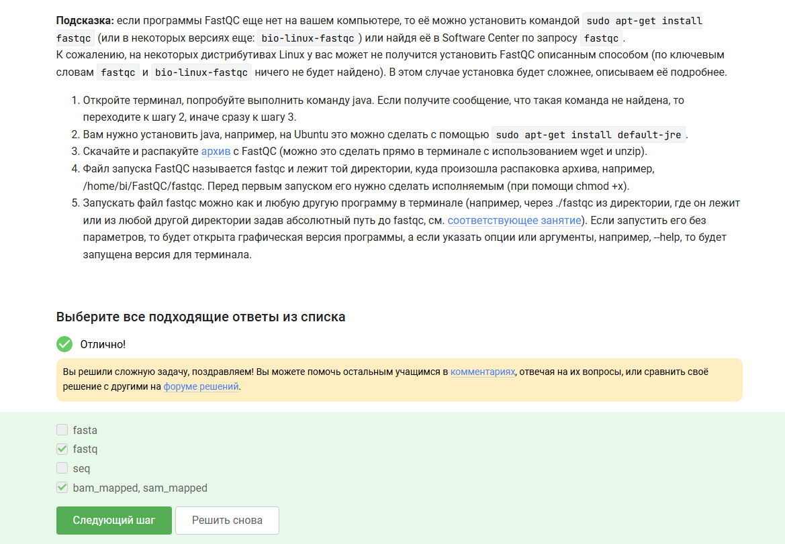{#fig:008 width=70%}

## Задание 9

Для множественного выравнивания файла `test.fasta` в ClustalW необходимо использовать команду `clustalw -INFILE=test.fasta -ALIGN`. Опция `-ALIGN` явно указывает режим множественного выравнивания, хотя он и является режимом по умолчанию. (рис. -@fig:009)

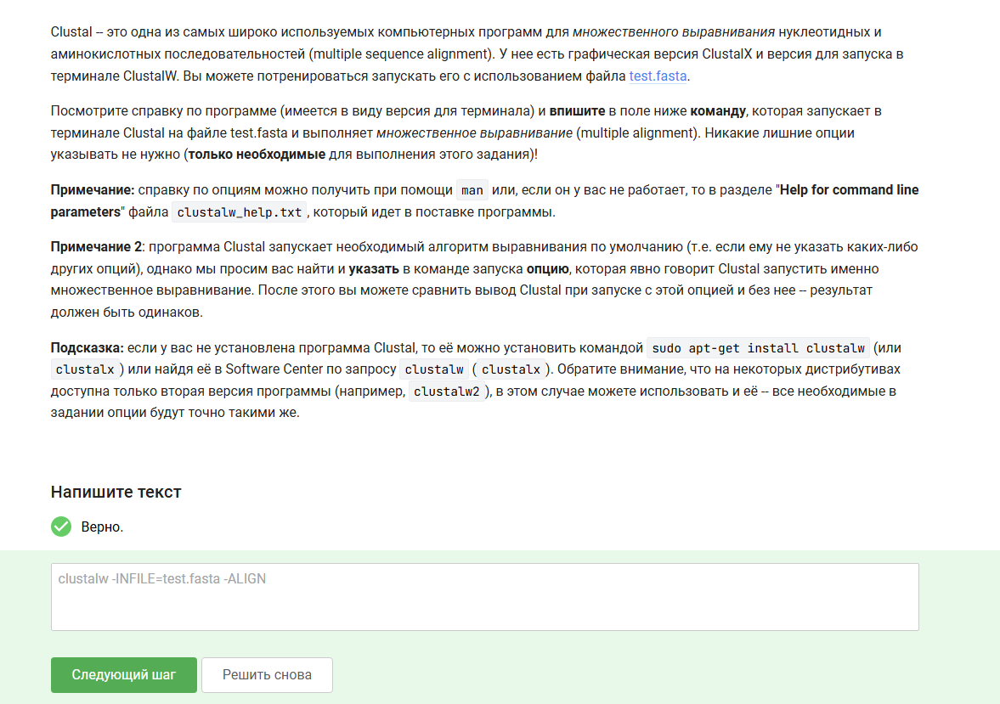{#fig:009 width=70%}

## Задание 10

После выполнения `fg %1` и `Ctrl+C` программа `program1` завершена. После `fg %2` и `Ctrl+Z` программа `program2` приостановлена и остаётся в списке `jobs`. Программа `program3` продолжает работать в фоне. Команда `jobs` покажет информацию о `program2` (приостановлена) и `program3` (работает в фоне). (рис. -@fig:010)

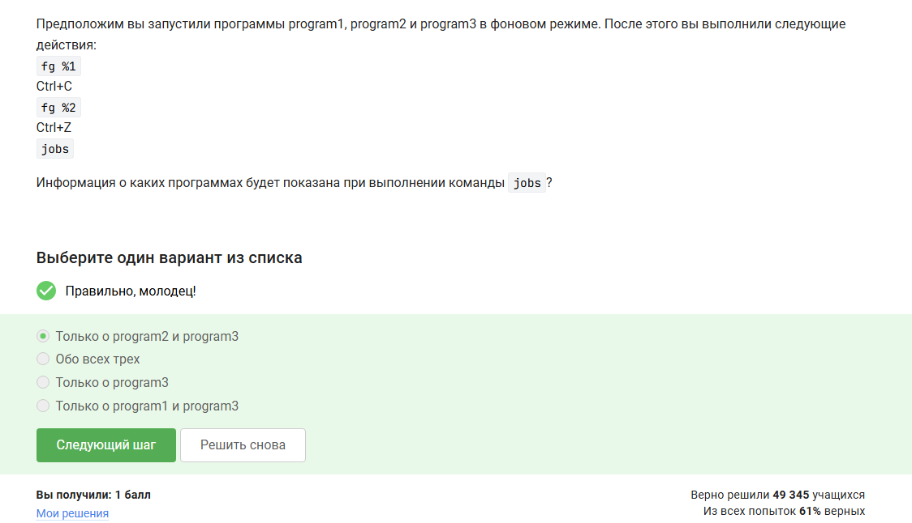{#fig:010 width=70%}

## Задание 11

Идентификаторы процессов (PID) одинаковы только у `ps` и `top` - оба используют стандартный идентификатор процесса операционной системы. У `jobs` своя нумерация (номера задач в текущей сессии оболочки), не совпадающая с PID. (рис. -@fig:011)

{#fig:011 width=70%}

## Задание 12

`kill -9` посылает сигнал `SIGKILL`, который немедленно уничтожает процесс без возможности его перехвата. Обычный `kill` посылает `SIGTERM` - процесс может его игнорировать. `kill -18` посылает `SIGCONT`, возобновляющий процесс, а не завершающий его. (рис. -@fig:012)

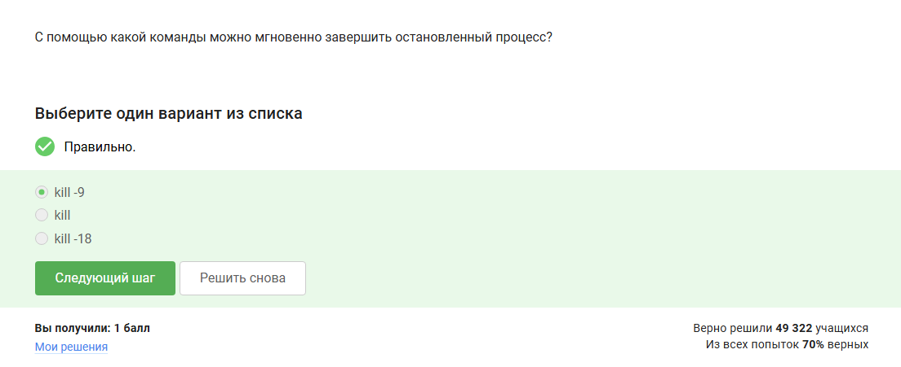{#fig:012 width=70%}

## Задание 13

Если применить `kill` (без опций, т.е. `SIGTERM`) к приостановленному процессу, сигнал будет доставлен, но процесс обработает его только после возобновления. Таким образом, процесс приступит к завершению, как только будет продолжен. (рис. -@fig:013)

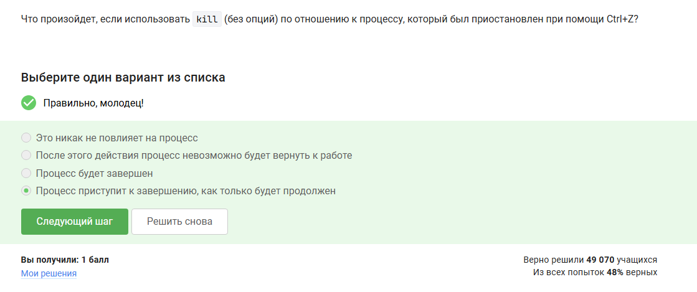{#fig:013 width=70%}

## Задание 14

Приостановленное (по Ctrl+Z) многопоточное приложение потребляет 0% CPU: процессор не выполняет никаких его инструкций, пока процесс находится в состоянии остановки. (рис. -@fig:014)

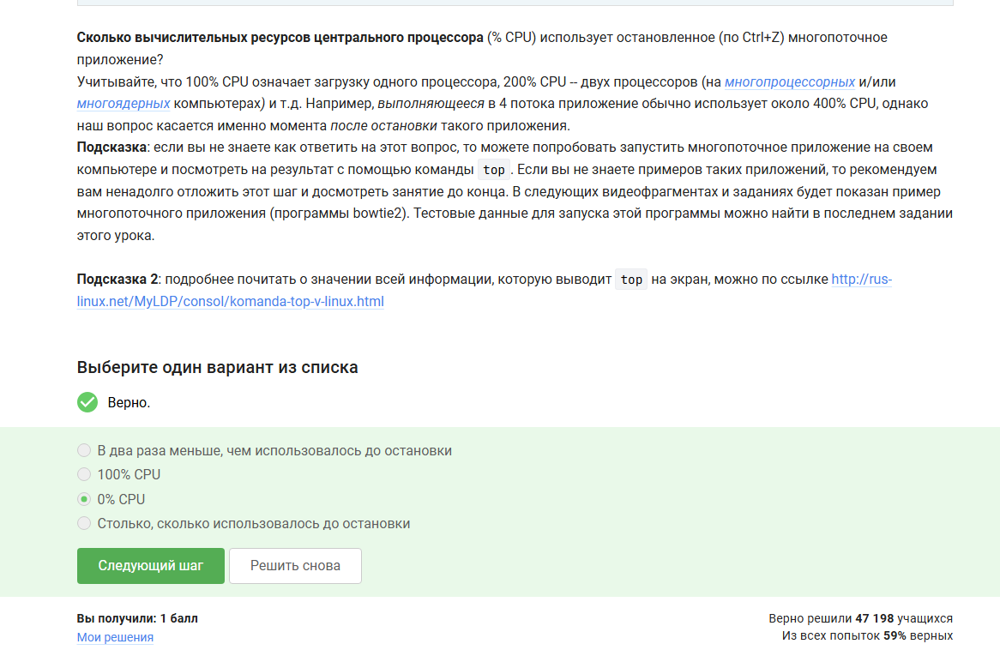{#fig:014 width=70%}

## Задание 15

Приостановленное приложение сохраняет столько памяти, сколько оно потребляло в момент остановки - все выделенные страницы остаются за процессом, пока он не завершится. (рис. -@fig:015)

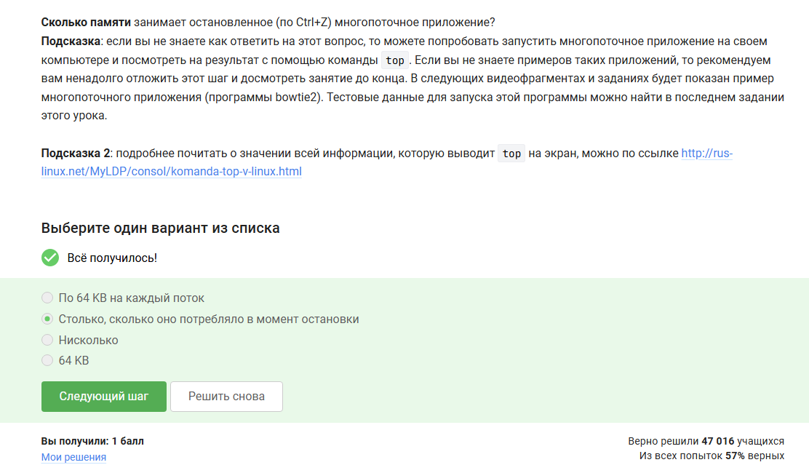{#fig:015 width=70%}

## Задание 16

Принудительно завершить один конкретный поток многопоточного приложения извне невозможно: стандартные сигналы Linux адресуются процессу целиком, а управление потоками - внутренняя задача самого приложения. (рис. -@fig:016)

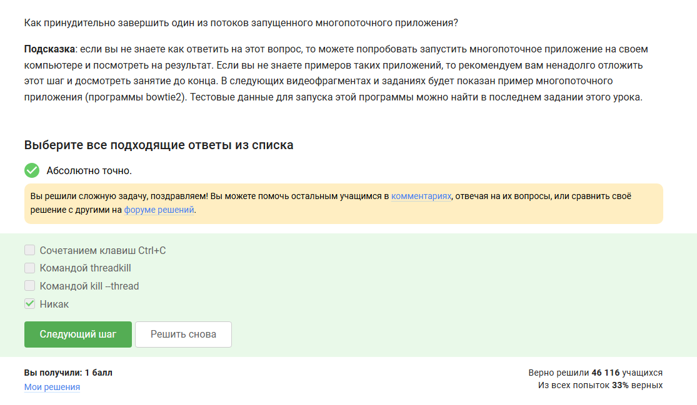{#fig:016 width=70%}

## Задание 17

Если в tmux осталась последняя открытая вкладка и в ней выполнить `exit`, сессия tmux завершится полностью: закрывать последнюю вкладку означает закрыть всю сессию. (рис. -@fig:017)

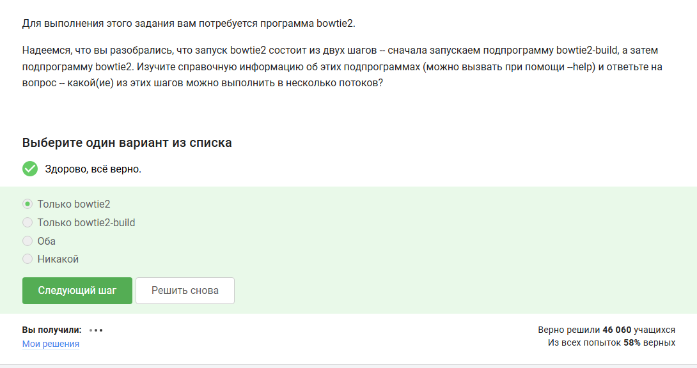{#fig:017 width=70%}

## Задание 18

Из двух подпрограмм bowtie2 в несколько потоков можно запустить только `bowtie2` (выравнивание), тогда как `bowtie2-build` (построение индекса) работает только в один поток. (рис. -@fig:018)

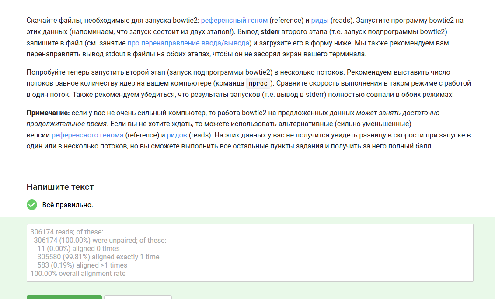{#fig:018 width=70%}

## Задание 19

Я скачал референсный геном и риды, запустил bowtie2-build, затем bowtie2, перенаправив stderr в файл. Вывод программы показал выравнивание 99.81% ридов, что подтверждает корректное выполнение задания. (рис. -@fig:019)

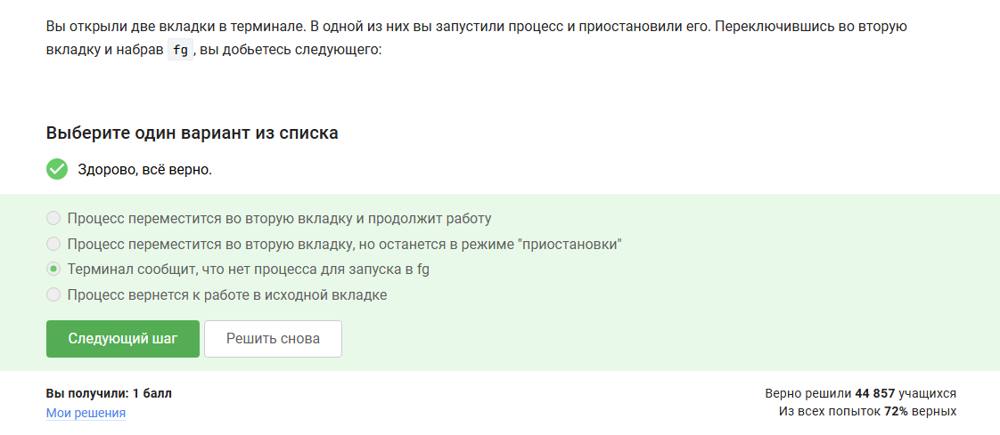{#fig:019 width=70%}

## Задание 20

Команда `fg` переводит процесс на передний план в рамках текущей вкладки терминала. Если процесс был приостановлен в другой вкладке, он недоступен из второй вкладки - терминал сообщит об отсутствии процесса для `fg`. (рис. -@fig:020)

{#fig:020 width=70%}

## Задание 21

Если закрыть терминал, в котором было открыто SSH-соединение с сервером и запущен tmux, соединение с сервером прервётся, однако сама сессия tmux и все запущенные в ней процессы продолжат работу на сервере. При повторном подключении к серверу можно присоединиться к прежней сессии командой `tmux attach`. (рис. -@fig:021)

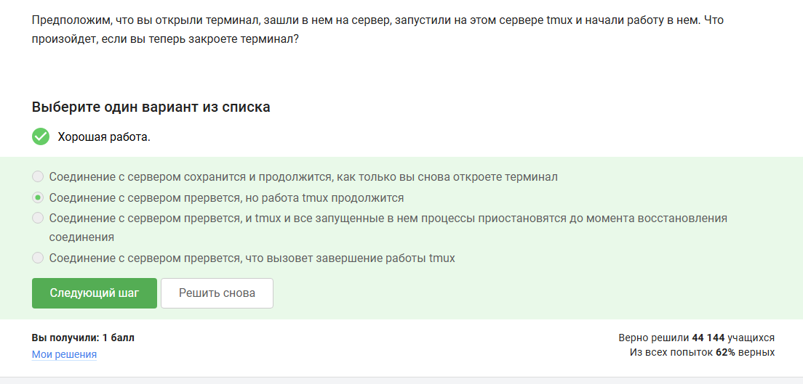{#fig:021 width=70%}

## Задание 22

Если запустить процесс в фоновом режиме в одной из вкладок tmux, а затем принудительно закрыть эту вкладку (Ctrl+B, X), вкладка закроется вместе с запущенным в ней процессом - tmux не переносит процесс в другую вкладку и не выдаёт предупреждение. (рис. -@fig:022)

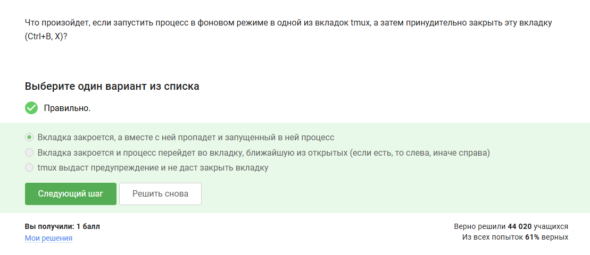{#fig:022 width=70%}

## Задание 23

Для переименования текущей вкладки в tmux используется сочетание клавиш Ctrl+B и , (запятая). Это позволяет задать произвольное имя вкладке, что удобно при работе с несколькими открытыми сессиями. (рис. -@fig:023)

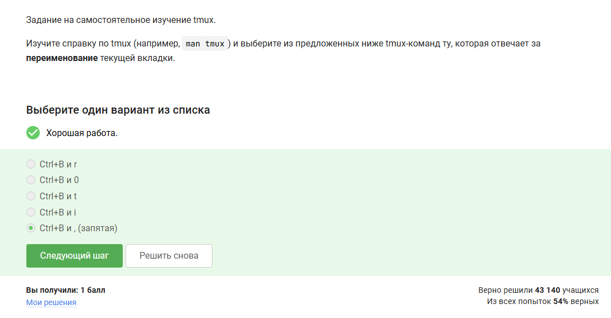{#fig:023 width=70%}

## Задание 24

Если разделить вкладку tmux горизонтально (Ctrl+B и "), а затем применить вертикальное разделение (Ctrl+B и %), получится 3 «части»: две маленькие (в нижней половине) и одна большая (верхняя). Команды разделения действуют только на текущую активную «часть», а не на все вкладки одновременно. (рис. -@fig:024)

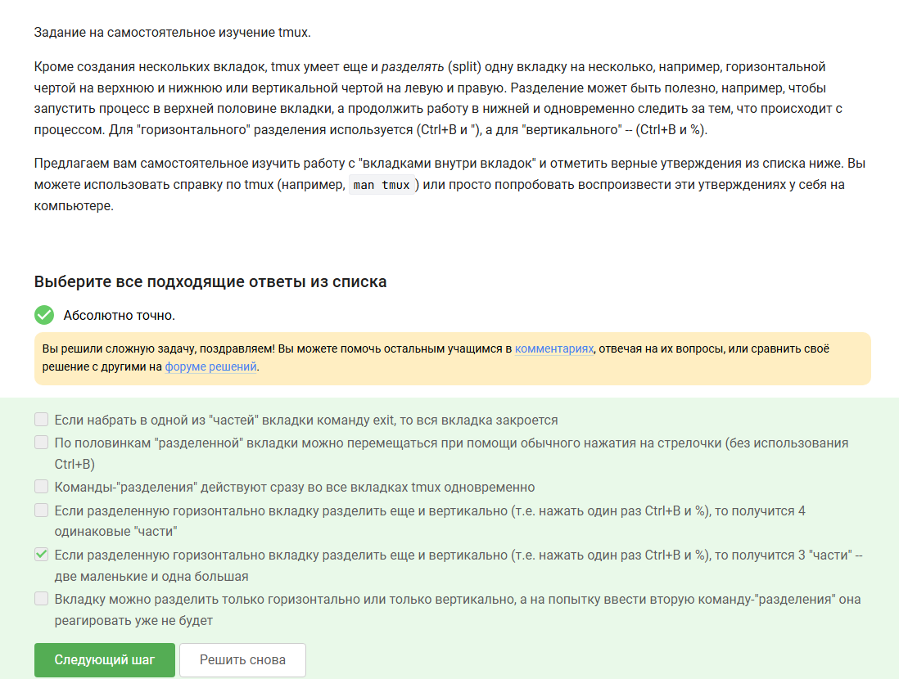{#fig:024 width=70%}

# Выводы

Я изучил материалы второй недели курса «Введение в Linux» и освоил навыки работы с:

- удалёнными серверами (подключение по SSH, назначение серверов)
- ключами RSA и безопасной передачей файлов (scp, FileZilla)
- управлением пакетами (apt-get update/install)
- процессами и потоками (jobs, fg, bg, kill, top, ps)
- многопоточными вычислениями (bowtie2)
- терминальным мультиплексором tmux
- биоинформатическими инструментами (FastQC, ClustalW, bowtie2)

Все 28 заданий успешно выполнены.

# Список литературы{.unnumbered}

::: {#refs}
:::
